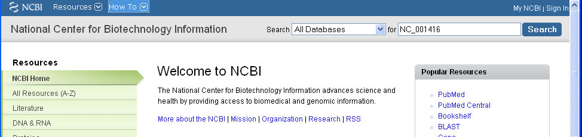
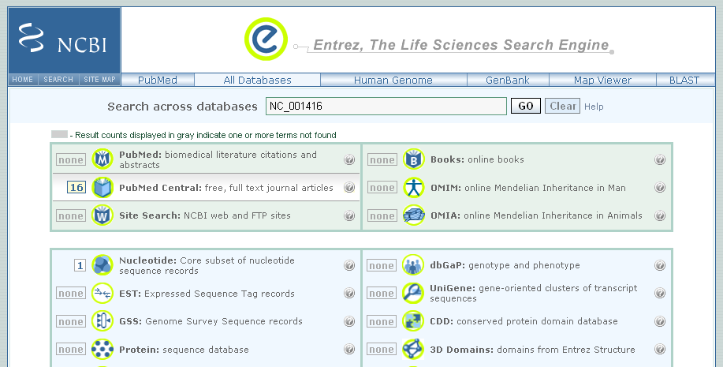
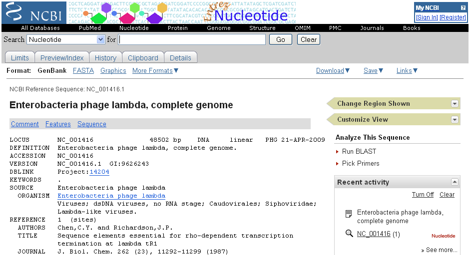
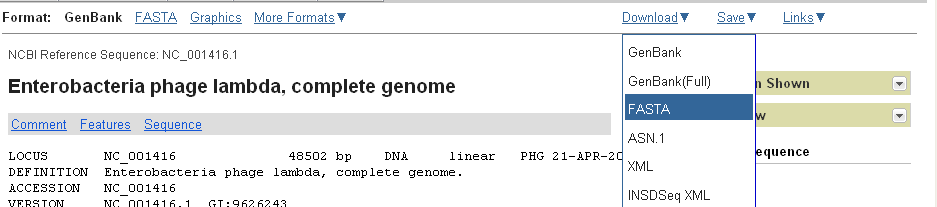
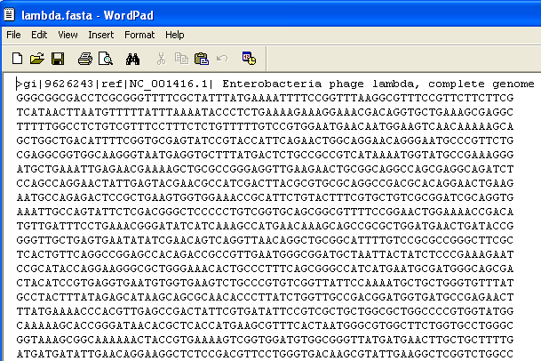

Practical 1 for 2009/2010 - DNA Sequence Statistics
===================================================

Starting R
----------

In your Statistics modules, you will have learnt to use the R
statistics package
(`www.r-project.org <http://www.r-project.org/>`_), a commonly used
free Statistics software. R allows you to carry out statistical
analyses in an interactive mode, as well as allowing simple
programming in a simple way that is a bit like Python.

To use R, you first need to start the R program on your computer.
To do this, click on the "Start" menu at the bottom left of your
Windows desktop, and then move your mouse over "All Programs" in
the menu that pops up, and then click on 'R' (or R X.X.X, where
X.X.X gives the version of R, eg. R 2.10.0) in the list of programs
that pops up. This should bring up a new window, which is the
*R console*.

A brief introduction to R
-------------------------

You will type R commands into the R console in order to carry out
analyses in R. In the R console you will see:

.. highlight:: r

::

    >

This is the R prompt. We type the commands needed for a particular
task after this prompt. The command is carried out after you hit
the Return key.

Once you have started R, you can start typing in commands, and the
results will be calculated immediately, for example:

::

    > 2*3
    [1] 6
    > 10-3
    [1] 7

All variables (scalars, vectors, matrices, etc.) created by R are
called *objects*. In R, we assign values to variables using an
arrow. For example, we can assign the value 2\*3 to the variable
*x* using the command:

::

    > x <- 2*3 

To view the contents of any R object, just type its name, and the
contents of that R object will be displayed:

::

    > x
    [1] 6

There are several possible different types of objects in R,
including scalars, vectors, matrices, arrays, data frames, tables,
and lists. The scalar variable *x* above is one example of an R
object. While a scalar variable such as *x* has just one element, a
vector consists of several elements. The elements in a vector are
all of the same type (eg. numeric or characters), while lists may
include elements such as characters as well as numeric quantities.

To create a vector, we can use the c() (combine) function. For
example, to create a vector called *myvector* that has elements
with values 8, 6, 9, 10, and 5, we type:

::

    > myvector <- c(8, 6, 9, 10, 5)

To see the contents of the variable *myvector*, we can just type
its name:

::

    > myvector
    [1]  8  6  9 10  5

The [1] is the index of the first element in the vector. We can
extract any element of the vector by typing the vector name with
the index of that element given in square brackets. For example, to
get the value of the 4th element in the vector *myvector*, we
type:

::

    > myvector[4]
    [1] 10

In contrast to a vector, a list can contain elements of different
types, for example, both numeric and character elements. A list can
also include other variables such as a vector. The list() function
is used to create a list. For example, we could create a list
*mylist* by typing:

::

    > mylist <- list(name="Fred", wife="Mary", myvector)

We can then print out the contents of the list *mylist* by typing
its name:

::

    > mylist
    $name
    [1] "Fred"
    
    $wife
    [1] "Mary"
    
    [[3]]
    [1]  8  6  9 10  5

The elements in a list are numbered, and can be referred to using
indices. We can extract an element of a list by typing the list
name with the index of the element given in double square brackets
(in contrast to a vector, where we only use single square
brackets). Thus, we can extract the second and third elements from
*mylist* by typing:

::

    > mylist[[2]]
    [1] "Mary"
    > mylist[[3]]
    [1]  8  6  9 10  5

Elements of lists may also be named, and in this case the elements
may be referred to either by giving the list name, followed by "$",
followed by the element name. For example, *mylist$name* is the
same as *mylist[[1]]* and *mylist$wife* is the same as
*mylist[[2]]*:

::

    > mylist$wife
    [1] "Mary"

We can find out the names of the named elements in a list by using
the *attributes()* function, for example:

::

    > attributes(mylist)
    $names
    [1] "name" "wife" ""    

When you use the attributes() function to find the named elements
of a list variable, the named elements are always listed under a
heading "$names". Therefore, we see that the named elements of the
list variable *mylist* are called "name" and "wife", and we can
retrieve their values by typing *mylist$name* and *mylist$wife*,
respectively.

Another type of object that you will encounter in R is a *table*
variable. For example, if we made a vector variable *mynames*
containing the names of children in a class, we can use the table()
function to produce a table variable that contains the number of
children with each possible name:

::

    > mynames <- c("Mary", "John", "Ann", "Sinead", "Joe", "Mary", "Jim", "John", "Simon")
    > table(mynames)
    mynames
       Ann    Jim    Joe   John   Mary  Simon Sinead 
         1      1      1      2      2      1      1 

We can store the table variable produced by the function table(),
and call the stored table "mytable", by typing:

::

    > mytable <- table(mynames)

To access elements in a table variable, you need to use double
square brackets, just like accessing elements in a list. For
example, to access the fourth element in the table *mytable* (the
number of children called "John"), we type:

::

    > mytable[[4]]
    [1] 2

Functions in R usually require *arguments*, which are input
variables (ie. objects) that are passed to them, which they then
carry out some operation on. For example, the log10() function is
passed a number, and it then calculates the log to the base 10 of
that number:

::

    > log10(100)
    2

In R, you can get help about a particular function by using the
help() function. For example, if you want help about the log10()
function, you can type:

::

    > help("log10")

When you use the help() function, a box will pop up with
information about the function that you asked for help with.

If you are not sure of the name of a function, but think you know
part of its name, you can search for the function name using the
help.search() function. For example, if you want to know if there
is a function to calculate the standard deviation of a set of
numbers, you can search for the names of all functions containing
the word "deviation" in their description by typing:

::

    > help.search("deviation")
    Help files with alias or concept or title matching
    �deviation� using fuzzy matching:
    
    genefilter::rowSds
                        Row variance and standard deviation of
                        a numeric array
    nlme::pooledSD      Extract Pooled Standard Deviation
    stats::mad          Median Absolute Deviation
    stats::sd           Standard Deviation
    vsn::meanSdPlot     Plot row standard deviations versus row

Among the functions that were found, the function sd() in the
"stats" library (an R library that comes with the standard R
installation) is for calculating the standard deviation.

We can perform computations with R using objects such as scalars
and vectors. For example, to calculate the average of the values in
the vector *myvector* (ie. the average of 8, 6, 9, 10 and 5), we
can use the mean() function:

::

    > mean(myvector)
    [1] 7.6

To quit R, type:

::

    > q()

R libraries for bioinformatics: Bioconductor and SeqinR
-------------------------------------------------------

Many authors have written R libraries for performing a wide variety
of analyses. These do not come with the standard R installation,
but must be installed and loaded as "add-ons".

Bioinformaticians have written several specialised *libraries* for
R. In this practical, you will learn to use the SeqinR library to
retrieve sequences from a DNA sequence database, and to carry out
simple analyses of DNA sequences.

Some well known bioinformatics libraries for R are the Bioconductor
set of R libraries
(`www.bioconductor.org <http://www.bioconductor.org/>`_), which
contains several libraries with many R functions for analysing
biological data sets such as microarray data; and the SeqinR
library
(`pbil.univ-lyon1.fr/software/seqinr <http://pbil.univ-lyon1.fr/software/seqinr>`_),
which contains R functions for obtaining sequences from DNA
sequence databases, and for analysing DNA sequences.

The SeqinR R library has already been installed on the computer
that you are using for this practical. To use the SeqinR library in
the R package, you need to load the SeqinR library into R (using
the library() function in R):

::

    > library("seqinr")

Remember that you can ask for more information about a particular R
command by using the help() function. For example, to ask for more
information about the library() function, you can type:

::

    > help("library")

FASTA format
------------

The FASTA format is a simple and widely used format for storing
biological (DNA or protein) sequences. It was first used by the
FASTA program for sequence alignment. It begins with a single-line
description starting with a ">" character, followed by lines of
sequences. Here is an example of a FASTA file:

> A06852 183 residues
MPRLFSYLLGVWLLLSQLPREIPGQSTNDFIKACGRELVRLWVEICGSVSWGRTALSLEE
PQLETGPPAETMPSSITKDAEILKMMLEFVPNLPQELKATLSERQPSLRELQQSASKDSN
LNFEEFKKIILNRQNEAEDKSLLELKNLGLDKHSRKKRLFRMTLSEKCCQVGCIRKDIAR
LC

The NCBI sequence database
--------------------------

The National Centre for Biotechnology Information (NCBI)
(`www.ncbi.nlm.nih.gov <http://www.ncbi.nlm.nih.gov/>`_) in the US
maintains a huge database of all the DNA and protein sequence data
that has been collected, the NCBI Sequence Database. This also a
similar database in Europe, the European Molecular Biology
Laboratory (EMBL) Sequence Database
(`www.ebi.ac.uk/embl <http://www.ebi.ac.uk/embl/>`_), and also a
similar database in Japan, the DNA Data Bank of Japan (DDBJ;
`www.ddbj.nig.ac.jp <http://www.ddbj.nig.ac.jp/>`_). These three
databases exchange data every night, so at any one point in time,
they contain almost identical data.

Each sequence in the NCBI Sequence Database is stored in a separate
*record*, and is assigned a unique identifier that can be used to
refer to that sequence record. The identifier is known as an
*accession*, and consists of a mixture of numbers and letters. For
example, Bacteriophage lambda infects the bacterium
*Escherichia coli*, and was one of the first viral genomes to be
completely sequenced (in 1982). The NCBI accession for the DNA
sequence of the Bacteriophage lambda is NC\_001416.

Note that because the NCBI Sequence Database, the EMBL Sequence
Database, and DDBJ exchange data every night, the Bacteriophage
lambda sequence will be present in all three databases, but it will
have different accessions in each database, as they each use their
own numbering systems for referring to their own sequence records.

Retrieving genome sequence data from NCBI
-----------------------------------------

You can easily retrieve DNA or protein sequence data from the NCBI
Sequence Database via its website
`www.ncbi.nlm.nih.gov <http://www.ncbi.nlm.nih.gov/>`_.

The Bacteriophage lamda DNA sequence is a viral DNA sequence, and
as mentioned above, its NCBI accession is NC\_001416. To retrieve
the DNA sequence for Bacteriophage lambda from NCBI, go to the NCBI
website, type "NC\_001416" in the Search box at the top right of
the webpage, and press the "Search" button beside the Search box.

|image0|

On the results page you will see the number of hits to "NC\_001416"
in each of the NCBI databases on the NCBI website. There are many
databases on the NCBI website, for example, the "PubMed" data
contains abstracts from scientific papers, the "Nucleotide"
database contains DNA and RNA sequence data, the "Protein" data
contains protein sequence data, and so on. The picture below shows
what the results page should look like for your NC\_001416 search.
As you are looking for the DNA sequence of the Bacteriophage lambda
genome, you expect to see a hit in the NCBI Nucleotide database,
and indeed there is hit in the Nucleotide database (indicated by
the "1" beside the icon for the Nucleotide database).

|image1|

To look at the one sequence found in the Nucleotide database, you
need to click on the icon for the NCBI Nucleotide database on the
results page for the search:

|image2|

When you click on the icon for the NCBI Nucleotide database, it
will bring you to the record for NC\_001416 in the NCBI Nucleotide
database. This will contain the name and NCBI accession of the
sequence, as well as other details such as any papers describing
the sequence.

|image3|

To retrieve the DNA sequence for the Bacteriophage lambda genome
sequence as a FASTA format sequence file, click on the "Download"
link at the top right of the NC\_001416 sequence record webpage,
and choose "FASTA" from the list that appears. A box will pop up
asking you what to name the file. You should give it a sensible
name (eg. "lambda.fasta") and save it in a place where you will
remember (eg. in the "My Documents" folder is a good idea).

|image4|

You can now open the FASTA file containing the Bacteriophage lambda
sequence using WordPad on your computer. To open WordPad, click on
"Start" on the bottom left of your screen, click on "All Programs"
in the menu that appears, and then select "Accessories" from the
menu that appears next, and then select "WordPad" from the menu
that appears next. WordPad should start up. In Wordpad, choose
"Open" from the "File" menu. The WordPad "Open" dialog will appear.
Set "Files of type" to "All Documents" at the bottom of the WordPad
"Open" dialog. You should see a list of files, now select the file
that contains the lambda sequence (eg. "lambda.fasta"). The
contents of the FASTA format file containing the lambda sequence
should now be displayed in WordPad.

|image5|

Reading genome sequence data into SeqinR
----------------------------------------

Using the SeqinR library in R, you can easily read a DNA sequence
from a FASTA file into R. For example, we described above how to
retrieve the Bacteriophage lambda genome sequence from the NCBI
database and save it in a FASTA format file (eg. "lambda.fasta").
You can read this FASTA format file into R using the read.fasta()
function from the SeqinR R library:

::

    > lambda <- read.fasta(file = "lambda.fasta")

Note that R expects the files that you read in (eg. "lambda.fasta")
to be in the "My Documents" folder on your computer, so if you
stored "lambda.fasta" somewhere else, you will have to move or copy
it into "My Documents".

The command above reads the contents of the fasta format file
lambda.fasta into an R object called *lambda*. The variable
*lambda* is an R list object. As explained above, a list is an R
object that is like a vector, but can contain elements that are
numeric and/or contain characters. In this case, the list *lambda*
contains information from the FASTA file that you have read in (ie.
the NCBI accession for the lambda sequence, and the DNA sequence
itself). In fact, the first element of the list object *lambda*
contains the the DNA sequence. As described above, we can access
the elements of an R list object using double square brackets.
Thus, we can store the DNA sequence for Bacteriophage lambda in a
variable *lambdaseq* by typing:

::

    > lambdaseq <- lambda[[1]]

The variable *lambdaseq* is a vector containing the nucleotide
sequence. Each element of the vector contains one nucleotide of the
sequence. Therefore, to print out a certain subsequence of the
sequence, we just need to type the name of the vector *lambdaseq*
followed by the square brackets containing the indices for those
nucleotides. For example, the following command prints out the
first 50 nucleotides of the Bacteriophage lambda genome sequence:

::

    > lambdaseq[1:50]
     [1] "g" "g" "g" "c" "g" "g" "c" "g" "a" "c" "c" "t" "c" "g" "c" "g" "g"
    [18] "g" "t" "t" "t" "t" "c" "g" "c" "t" "a" "t" "t" "t" "a" "t" "g" "a"
    [35] "a" "a" "a" "t" "t" "t" "t" "c" "c" "g" "g" "t" "t" "t" "a" "a"

Note that *lambdaseq[1:50]* refers to the elements of the vector
*lambdaseq* with indices from 1-50. These elements contain the
first 50 nucleotides of the Bacteriophage lambda sequence.

Length of a DNA sequence
------------------------

Once you have retrieved a DNA sequence, we can obtain some simple
statistics to describe that sequence, such as the sequence's total
length in nucleotides. In the above example, we retrieved the
Bacteriophage lambda genome sequence, and stored it in the vector
variable *lambdaseq* To subsequently obtain the length of the
genome sequence, we would use the length() function, typing:

::

    > length(lambdaseq)
    [1] 48502

The length() function will give you back the length of the sequence
stored in variable *lambdaseq*, in nucleotides. The length()
function actually gives the number of elements in the input vector
that you pass to it, which in this case in the number of elements
in the vector *lambdaseq*. Since each element of the vector
*lambdaseq* contains one nucleotide of the Bacteriophage lambda
sequence, the result for the Bacteriophage lambda genome tells us
the length of its genome sequence (ie. 48502 nucleotides long).

Base composition of a DNA sequence
----------------------------------

An obvious first analysis of any DNA sequence is to count the
number of occurrences of the four different nucleotides ("A", "C",
"G", and "T") in the sequence. This can be done using the the
table() function. For example, to find the number of As, Cs, Gs,
and Ts in the Bacteriophage lambda sequence (which you have put
into vector variable *lambdaseq*, using the commands above), you
would type:

::

    > table(lambdaseq)
    lambdaseq
        a     c     g     t 
    12334 11362 12820 11986

This means that the Bacteriophage lambda genome sequence has 12334
As, 11362 Cs, 12820 Gs and 11986 Ts.

GC Content of DNA
-----------------

One of the most fundamental properties of a genome sequence is its
GC content, the fraction of the sequence that consists of Gs and
Cs, ie. the %(G+C).

The GC content can be calculated as the percentage of the bases in
the genome that are Gs or Cs. That is, GC content = (number of Gs +
number of Cs)\*100/(genome length). For example, if the genome is
100 bp, and 20 bases are Gs and 21 bases are Cs, then the GC
content is (20 + 21)\*100/100 = 42%.

You can easily calculate the GC content based on the number of As,
Gs, Cs, and Ts in the genome sequence. For example, for the
Bacteriophage lambda genome sequence, we know from using the
table() function above that the genome contains 12334 As, 11362 Cs,
12820 Gs and 11986 Ts. Therefore, we can calculate the GC content
using the command:

::

    > (11362+12820)*100/(12334+11362+12820+11986)
    [1] 49.85774

Alternatively, if you are feeling lazy, you can use the GC()
function in the SeqinR library, which gives the fraction of bases
in the sequence that are Gs or Cs.

::

    > GC(lambdaseq)
    [1] 0.4985774

The result above means that the fraction of bases in the
Bacteriophage lambda genome that are Gs or Cs is 0.4985774. To
convert the fraction to a percentage, we have to multiply by 100,
so the GC content as a percentage is 49.85774%.

DNA words
---------

As well as the frequency of each of the individual nucleotides
("A", "G", "T", "C") in a DNA sequence, it is also interesting to
know the frequency of longer DNA "words". The individual
nucleotides are DNA words that are 1 nucleotide long, but we may
also want to find out the frequency of DNA words that are 2
nucleotides long (ie. "AA", "AG", "AC", "AT", "CA", "CG", "CC",
"CT", "GA", "GG", "GC", "GT", "TA", "TG", "TC", and "TT"), 3
nucleotides long (eg. "AAA", "AAT", "ACG", etc.), 4 nucleotides
long, etc.

To find the number of occurrences of DNA words of a particular
length, we can use the count() function in R. For example, to find
the number of occurrences of DNA words that are 1 nucleotide long
in the sequence *lambdaseq*, we type:

::

     
    > count(lambdaseq, 1)
        a     c     g     t 
    12334 11362 12820 11986 

As expected, this gives us the number of occurrences of the
individual nucleotides. To find the number of occurrences of DNA
words that are 2 nucleotides long, we type:

::

    > count(lambdaseq, 2)
      aa   ac   ag   at   ca   cc   cg   ct   ga   gc   gg   gt   ta   tc 
    3692 2573 2732 3337 3216 2497 3113 2536 3256 3615 3180 2768 2170 2677 
      tg   tt 
    3794 3345 

If you type help('count'), you will see that the result (output) of
the function count() is a *table* object. This means that you can
use double square brackets to extract the values of elements from
the table. For example, to extract the value of the third element
(the number of Gs in the lambda sequence), you can type:

::

    > lambdatable <- count(lambdaseq,1)
    > lambdatable[[3]] 
    [1] 12820

The command above extracts the third element of the table produced
by count(lambdaseq,1), which we have stored in the table variable
*lambdatable*.

Summary
-------

In this practical, you will have learnt to use the following R
functions:

#. c() (combine) for creating a vector
#. list() for creating a list
#. attributes() for finding out the names of the attributes of a
   variable
#. log10() for calculating the log to the base 10 of a number
#. mean() for calculating the average value of the numbers in a
   vector
#. help() for finding out more information about an R function
#. help.search() for searching for R functions
#. q() for quitting R
#. library() for loading an R library that is already installed
#. length() for finding the length of a vector or list
#. table() for printing out a table of the number of occurrences of
   each type of item in a vector or list.

All of these functions belong to the standard installation of R.

You have also learnt the following R functions that belong to the
SeqinR library:

#. GC() for calculating the GC content for a DNA sequence
#. count() for calculating the number of occurrences of DNA words
   of a particular length in a DNA sequence

Links and Further Reading
-------------------------

Some links are included here for further reading, which will be
especially useful if you need to use the R package and SeqinR
library for your project or assignments.

For background reading on DNA sequence statistics, it is
recommended to read Chapter 1 of
*Introduction to Computational Genomics: a case studies approach*
by Cristianini and Hahn (Cambridge University Press;
`www.computational-genomics.net/book/ <http://www.computational-genomics.net/book/>`_).

For a more in-depth introduction to R, a good online tutorial is
available on the "Kickstarting R" website,
`cran.r-project.org/doc/contrib/Lemon-kickstart <http://cran.r-project.org/doc/contrib/Lemon-kickstart/>`_.

There is also a useful introduction to R in Appendix A ("A Brief
Introduction to R") of the book
*Computational genome analysis: an introduction* by Deonier, Tavaré
and Waterman (Springer).

There is another nice (slightly more in-depth) tutorial to R
available on the "Introduction to R" website,
`cran.r-project.org/doc/manuals/R-intro.html <http://cran.r-project.org/doc/manuals/R-intro.html>`_.

For more in-depth information and more examples on using the SeqinR
library for sequence analysis, look at the SeqinR documentation,
`seqinr.r-forge.r-project.org/seqinr\_2\_0-1.pdf <http://seqinr.r-forge.r-project.org/seqinr_2_0-1.pdf>`_.

There is also a very nice chapter on "Analyzing Sequences", which
includes examples of using SeqinR for sequence analysis, in the
book *Applied statistics for bioinformatics using R* by Krijnen
(available online at
`cran.r-project.org/doc/contrib/Krijnen-IntroBioInfStatistics.pdf <http://cran.r-project.org/doc/contrib/Krijnen-IntroBioInfStatistics.pdf>`_).

Acknowledgements
----------------

Many of the ideas for the examples and exercises for this practical
were inspired by the Matlab case studies on
*Haemophilus influenzae*
(`www.computational-genomics.net/case\_studies/haemophilus\_demo.html <http://www.computational-genomics.net/case_studies/haemophilus_demo.html>`_)
and Bacteriophoage lambda
(`http://www.computational-genomics.net/case\_studies/lambdaphage\_demo.html <http://www.computational-genomics.net/case_studies/lambdaphage_demo.html>`_)
from the website that accompanies the book
*Introduction to Computational Genomics: a case studies approach*
by Cristianini and Hahn (Cambridge University Press;
`www.computational-genomics.net/book/ <http://www.computational-genomics.net/book/>`_).

Thank you to Jean Lobry and Simon Penel for helpful advice on using
the SeqinR library.

Exercises
---------

Answer the following questions, using the R package. For each
question, please record your answer, and what you typed into R to
get this answer.

Q1. What are the last twenty nucleotides of the Bacteriophage lambda genome sequence?Q2. What is the length in nucleotides of the genome sequence for the bacterium *Haemophilus influenzae* strain Rd KW20 (accession L42023)?
    Note: *Haemophilus influenzae* is a bacterium that is responsible
    for a wide range of clinical diseases in humans. The
    *Haemophilus influenzae* strain Rd KW20 genome was the first to
    genome of a free-living organism to be fully sequenced. As the
    genome sequence is a DNA sequence, you need to look for it in the
    NCBI Nucleotide database.
Q3. How many of each of the four nucleotides A, C, T and G, and any other symbols, are there in the *Haemophilus influenzae* Rd KW20 genome sequence?
    Note: other symbols apart from the four nucleotides A/C/T/G may
    appear in a sequence. They correspond to positions in the sequence
    that are are not clearly one base or another and they are due, for
    example, to sequencing uncertainties. or example, the symbol 'N'
    means 'aNy base', while 'R' means 'A or G' (puRine). There is a
    table of symbols at
    `www.bioinformatics.org/sms/iupac.html <http://www.bioinformatics.org/sms/iupac.html>`_.
Q4. What is the GC content of the *Haemophilus influenzae* Rd KW20 genome sequence, when (i) all non-A/C/T/G nucleotides are included, (ii) non-A/C/T/G nucleotides are discarded?
    Hint: look at the help page for the GC() function to find out how
    it deals with non-A/C/T/G nucleotides.
Q5. How many of each of the four nucleotides A, C, T and G are there in the complement of the *Haemophilus influenzae* Rd KW20 genome sequence?
    Hint: you will first need to search for a function to calculate the
    complement of a sequence. Once you have found out what function to
    use, remember to use the help() function to find out what are the
    arguments (inputs) and results (outputs) of that function. How does
    the function deal with symbols other than the four nucleotides A,
    C, T and G?
    Are the numbers of As, Cs, Ts, and Gs in the complementary sequence
    what you would expect?
Q6. How many occurrences of the DNA words CC, CG and GC occur in the *Haemophilus influenzae* Rd KW20 genome sequence?Q7. How many occurrences of the DNA words CC, CG and GC occur in the (i) first 1000 and (ii) last 1000 nucleotides of the *Haemophilus influenzae* Rd KW20 genome sequence?
    How can you check that the subsequence that you have looked at is
    1000 nucleotides long?

.. |image2| image:: ../_static/P1_image3.png

