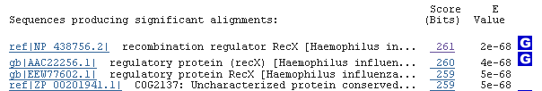
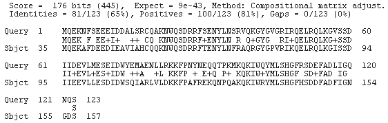
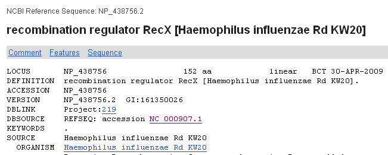
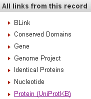
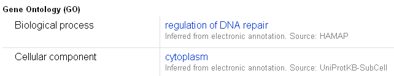
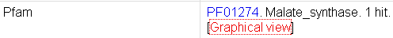

Practical 8 for 2009/2010 - Predicting the Functions of Candidate Genes
=======================================================================

Introduction
------------

In the previous practical (see Practical 7,
`http://www.ucc.ie/microbio/MB6301/practical7\_genefinding.html <http://www.ucc.ie/microbio/MB6301/practical7_genefinding.html>`_),
you learnt how to identify candidate genes in a newly sequenced
bacterial genome or part of a bacterial genome. Identifying
candidate genes in a eukaryotic genome (eg. human or sunflower) is
more difficult, and requires special software for this purpose (eg.
Genscan, GeneWise). Once you have identified candidate genes, the
next step is to predict the biological functions of the proteins
predicted to be encoded by those genes. This can be done using a
variety of bioinformatics approaches, which we will explore today.

Say, for example, that you have just sequenced the whole genome of
an *Escherichia coli* strain that you have isolated from a patient.
Using the bioinformatics methods described in Practical 7, you
identified all ORFs in the genome above a certain threshold length.
These ORFs that you have found are your candidate genes in the
*E. coli* strain's genome. You now want to know what is the
function of each of the proteins predicted to be encoded by those
candidate genes (ORFs). For each ORF, you have the genomic DNA
sequence for the ORF, as well as the amino acid sequence of the
protein that is predicted to be encoded by that gene. For example,
this is one of the predicted proteins encoded by one of your ORFs:

::

    >orf932  
    MSQCITQSRLRIDANFKRFVDEEVLPGTGLDAAAFWRNFDESVHDLAPENRQLRSERDRI
    QAALDEWHRSNPGPVKDKAAYKSFLRELGYLVPQPERVTVETTGIDSEITSQAGPQLVVP
    AMNARYALNAANARWGSLYDALYGSDIIPQEGAMVSGYDPQRGEQVIAWVRRFLDESLPL
    ENGSYQDVVAFKVVDKQLRIQLKNGKETTLRTPAQFVGYRGDAAAPTCILLKNNGLHIEL
    QIDANGRGGKDDPAHINDVIVEAAISTILDCEDSVAAVDAEDKILLYRNLLGLMQGTLQE
    KMEKNGRQIVRKLNDDRHYTAADGSEISLHGRSLLFIRNVGHLMTIPVIWDSEGNEIPEG
    ILDGVMTGAIALYDLKVQKNSRTGSVYIVKPKMHGPQEVAFANKLFTRIETMLGMAPNTL
    KMGIMDEERRTSLNLRSCIAQARNRVAFINTGFLDRTGDEMHSVMEAGPMLRKNQMKSTP
    WIKAYERNNVLSGLFCGLRGKAQIGKGMWAMPDLMADMYSQKGDQLRAGANTAWVPSPTA
    ATLHALHYHQTNVQSVQANIAQTEFNAEFEPLLDDLLTIPVAENANWSAQEIQQELDNNV
    QGILGLEVRWVEQGIGCSKVPDIHNVALMEDRATLRISSQHIANWLRHGILTKEQVQASL
    ENMAKVVDQQNAGDPAYRPMAGNFANSCAFKAASDLIFLGVKQPNGYTEPLLHAWRLREK
    ESH

Your question is: what is the biological function of this predicted
protein (if it does correspond to a real protein)?

BLAST
-----

One of the first steps in predicting the function of a candidate
protein is to try to find potential homologues of the candidate
protein. One way of doing this is to run BLAST using the candidate
gene's predicted protein sequence as the query, and search for
sequence matches in the NCBI Protein database.

To search the NCBI Protein database using the predicted protein
sequence from the above candidate gene's predicted protein as your
query, follow these steps:

#. Go to the NCBI BLAST website,
   `http://blast.ncbi.nlm.nih.gov/Blast.cgi <http://blast.ncbi.nlm.nih.gov/Blast.cgi>`_
#. On the NCBI BLAST website, you need to choose what type of BLAST
   job you want to run. You have a protein sequence query, and want to
   use it to search a protein sequence database (the NCBI Protein
   database), so click on 'protein blast'.
#. On the next page, you need to paste in your query sequence in
   the box under 'Enter accession number, gi, or FASTA sequence'.
   Paste your query sequence (which you may have stored in a FASTA
   file) into the Query box on the NCBI BLAST website.
#. Note that you need to paste in the sequence in FASTA format, so
   you should include the FASTA header line (eg. the line containing
   '>orf93').
#. Press the 'BLAST' button at the bottom of the page to run
   BLAST.

BLAST will take a couple of minutes to run. When it has finished,
the BLAST results page will appear. If you scroll down the results
page, under the heading 'Descriptions' you will see a list of the
BLAST matches, in order of increasing E-value (ie. with the most
significant hits, which have the lowest E-values, first). This is
known as the *BLAST hit list*. In the list of BLAST matches, for
each BLAST match there is a link on the left to the protein
sequence for the database protein with the BLAST match, and a link
on the right to the BLAST alignment between the query protein and
the database protein.

For example, in the picture below, the database protein with the
most significant BLAST match is 'ref\|NP\_438756.2'. The E-value
for the BLAST hit is 2e-68 (ie. 2 x 10^68) , and the score for the
alignment between the query protein and database protein is 261. If
we click on the link to 'ref\|NP\_438756.2', it will bring us to
the NCBI entry for that protein, while if we click on the '261'
link, it will bring us to the BLAST alignment between the query
protein and that database protein.

|image0|

Note that in your BLAST hit list, you will probably see some
proteins starting with 'ref\|NP\_...'. These are proteins in
RefSeq, the curated part of NCBI. It is best to look at BLAST hits
in RefSeq, as there is the most information about them in the
database. Note that if there is a large difference in E-value
between the top BLAST hit, and the top RefSeq BLAST hit, this would
suggest that your candidate gene's predicted protein is much more
closely related to the top BLAST hit that to the top RefSeq BLAST
hit, so you might want to look at both of them to get an idea of
the function of your candidate gene's predicted protein.

As mentioned above, if you click on the link to the score for the
top RefSeq BLAST hit in the BLAST hit list (eg. the '261' link in
the picture above), it will bring you to the alignment between the
query protein and the top RefSeq BLAST hit. Above the alignment for
the query protein and a particular BLAST hit, you can see
information such as the percent identity between the query protein
and the BLAST hit in the alignment. For example, in the picture
below, the query protein and the database protein are 65% identical
in the regions of those proteins that BLAST aligned.

|image1|

RefSeq
------

As mentioned above, if you click on the link to the database
protein name in the BLAST hit list (eg. the link to
'ref\|NP\_438756.2' in the picture above), it will bring you to the
NCBI entry for that protein.

The NCBI entry for a protein contains some functional information
on that protein. Beside the word 'DEFINITION' on the left, there is
a brief description of the function of that protein. This gives you
an initial idea of the function of the protein. For example, in the
NCBI entry for the protein 'ref\|NP\_438756.2' shown below, we see
that the definition line is 'recombination regulator RecX
[Haemophilus influenzae Rd KW20]'. This gives us some functional
information: it tells us that the query protein has a BLAST match
to a protein that regulates recombination in
*Haemophilus influenzae*.

|image2|

UniProt
-------

To obtain high-quality curated data for a particular protein, a
good idea is to look at the entry for that protein in the UniProt
database (`www.uniprot.org <http://www.uniprot.org>`_), which
contains curated data for proteins.

In the NCBI entry for a protein, you should see a link to the
UniProt entry on the bottom right of the page, saying 'Protein
(UniProtKB)':

|image3|

This will bring you to a page that gives a link to the UniProt
entry for the protein, on the line saying 'DBSOURCE UniProtKB:
locus .... accession ....'

|image4|

If you click on the UniProt accession number at the end of this
line (eg. 'P43706' is the UniProt accession number in the picture
above), it will bring you to the UniProt webpage for the protein.

The UniProt page for a protein contains curated information for
that protein, that has been entered by curators who have read
papers describing that protein. Therefore, the UniProt page for a
protein generally contains very high quality and useful
information. There can several types of functional information in
the UniProt page for a protein. At the top of the page, Under
'Names and origin', if the protein is an enzyme, it will have an
Enzyme Commission (E.C.) number given in the 'Protein names' field.
The E.C. classification system classifies enzymes by the reaction
that they carry out. If you click on the E.C. number, it will bring
you to a webpage for that E.C. number (on the E.C. database
website,
`http://www.expasy.org/enzyme/ <http://www.expasy.org/enzyme/>`_),
which describes the biochemical reaction carried out by enzymes
with that E.C. number.

Under the heading 'General annotation', you will see a field for
'Function' which gives a brief description of the protein's
function. If this says 'By similarity' beside it, you need to treat
this functional description with caution, because it has been
predicted based on sequence similarity to another protein. Beside
the field 'Subcellular location', there is information on the
location in the cell in which the protein is found. If this says
'Potential' beside it, you need to treat it with caution, as it is
just a prediction.

The Gene Ontology (GO)
----------------------

Further down the UniProt page for the protein, under the heading
'Ontologies', you will see the 'Gene Ontology (GO)' terms that have
been ascribed to the protein. The Gene Ontology
(`http://www.geneontology.org/ <http://www.geneontology.org/>`_) is
a controlled vocabulary that contains terms for describing the
biological process (eg. heart contraction), cellular component (eg.
cytoplasm), and molecular function (eg. lactase activity) of a
protein. GO terms can be assigned to a protein by a curator who has
read papers about that protein, or can be assigned to a protein on
the basis of sequence similarity to other proteins that curators
have already assigned GO terms to. If it says 'Inferred from
electronic annotation' under a GO term on the UniProt page, then
you treat the GO information with caution, as it means that the GO
term was assigned to the protein because the protein has sequence
similarity to some other protein that a GO curator has given that
GO term to.

|image5|

The Gene Ontology is a hierarchy, with more general GO terms at the
top of the hierarchy (eg. "catalytic activity"), and more specific
GO terms at the bottom of the hierarchy (eg. "glycerol dehydratase
activity"). Thus, the GO terms that have been assigned to a
particular protein sequence in UniProt will be "children" of more
general "parent" GO terms, and will probably also be "parents"
themselves of more specific GO terms.

On the UniProt page for a protein, you will see a list of its GO
terms, and if you click on one of the GO terms, a page with more
information about the GO term will appear, and you can click on a
link labelled "Ancestor Chart" to see all the "ancestors" (parents,
grandparents, great-grandparents, etc.) of your GO term. You can
also click on a link labelled "Child Terms" to find out if the GO
term has any child terms. Not all GO terms will necessary have
child terms, depending on where your GO term sits in the overall GO
hierarchy (if it is a more general term and sits at the top of the
hierarchy, it will probably have child terms).

KEGG
----

Further down the UniProt page for the protein, under 'Genome
annotation databases', you will see a link to the KEGG Pathway
database
(`http://www.genome.jp/kegg/pathway.html <http://www.genome.jp/kegg/pathway.html>`_),
which contains information on biochemical pathway information. For
example, in the picture below, the KEGG accession number is
'hin:HI0599':

|image6|

Pfam
----

Lastly, further down the UniProt page again, under 'Family and
domain databases', you will see a link to the Pfam database
(`http://pfam.sanger.ac.uk <http://pfam.sanger.ac.uk/>`_), which
contains information on protein domains. Domains are regions of a
protein sequence that have a particular biological function. Each
domain forms a compact three-dimensional structure. As domains
perform important biological functions, they tend to be very well
conserved in related proteins, as there is strong selection against
mutations that would disrupt the function of the domains. The Pfam
database is a database of protein domains. If you click on the link
on the UniProt page to the Pfam domains found in this protein (if
any), you will obtain information on each domain, and its known
function. This will provide clues as to the function of the
protein.

|image7|

More about KEGG
---------------

The KEGG Pathway database is a database of pathways of different
types, including metabolic pathways, signalling pathways, and
genetic interaction pathways. Each biochemical pathway is
represented in the KEGG database by a pathway map. For example,
take a look at the KEGG pathway for the citrate cycle in *E. coli*
strain K-12 MG1655, at
`http://www.genome.jp/dbget-bin/show\_pathway?eco00020 <http://www.genome.jp/dbget-bin/show_pathway?eco00020>`_.

In the pathway diagram, each enzyme in the pathway is represented
by a rectangle, inside which its E.C. (Enzyme Commission) number is
given. The E.C. number specifies which chemical reaction the enzyme
carries out. On the pathway diagram for a particular
species/strain, the rectangle for an enzyme is coloured in if that
enzyme is found in that species/strain. If the rectangle is not
coloured in (is white), then it means that that enzyme is absent
from that particular species/strain.

As we saw above, the UniProt page for a protein gives the KEGG
accession numbers for that protein. For example, to find that
protein in the KEGG database, you need to go to the KEGG homepage
(`http://www.genome.jp/kegg/ <http://www.genome.jp/kegg/>`_) and
type the KEGG accession number of the protein (as noted down from
UniProt) in the search box at the top of the page, and press 'Go'
to search.

This should find the KEGG page for the protein. On the KEGG page
for the protein, if that protein is present in a KEGG pathway, you
should see some links in the 'Pathway' field (the fifth row down in
the table on the KEGG protein page). Each pathway will have a name,
eg. 'pyruvate metabolism'. If you click on the links to the
pathways that the protein is in, it will bring up the pathway
diagram for that species/strain, with the particular protein
highlighted (the rectangle representing that enzyme in the pathway
will have a red border).

Summary
-------

In this practical, you learnt how to predict the function of a
predicted protein from a candidate gene.

Links and Further Reading
-------------------------

Here are some links and tutorials that may be helpful to you if you
need to use BLAST, the RefSeq or UniProt databases, the Gene
Ontology, Pfam, or KEGG in your research project:

#. A tutorial on how to run BLAST at NCBI:
   `http://www.ncbi.nlm.nih.gov/Class/BLAST/blast\_course.short.html <http://www.ncbi.nlm.nih.gov/Class/BLAST/blast_course.short.html>`_
#. A description of RefSeq:
   `http://www.ncbi.nlm.nih.gov/RefSeq/ <http://www.ncbi.nlm.nih.gov/RefSeq/>`_
#. An introduction to UniProt:
   `http://education.expasy.org/cours/Document/UniProtKB\_Quickguid.pdf <http://education.expasy.org/cours/Document/UniProtKB_Quickguid.pdf>`_
#. An introduction to the Gene Ontology:
   `http://www.geneontology.org/GO.doc.shtml <http://www.geneontology.org/GO.doc.shtml>`_
#. An introduction to Pfam:
   `http://pfam.sanger.ac.uk/help <http://pfam.sanger.ac.uk/help>`_
#. An introduction/tutorial to KEGG:
   `http://www.genome.jp/kegg/docs/slides/tutorial1/pg00.html <http://www.genome.jp/kegg/docs/slides/tutorial1/pg00.html>`_

Exercises
---------

Answer the following questions. For each question, please record
your answer, and what you typed or did to get this answer.

Q1. The file `http://www.ucc.ie/microbio/MB6301/practical8\_candidates.txt <http://www.ucc.ie/microbio/MB6301/practical8_candidates.txt>`_ contains predicted protein sequences of candidate genes that were predicted by a gene-finding program in a bacterial genome sequence. 
    Each student will be assigned the predicted protein from a
    different candidate gene. Find the sequence that has been assigned
    to you.
Q2. What is the NCBI accession number of the top BLAST hit of the predicted protein sequence for your candidate gene? 
    What is the top RefSeq BLAST hit?
Q3. What species/strain is the top BLAST hit from? 
    What about the top RefSeq BLAST hit?
Q4. What is the E-value for the BLAST hit, and what is the percent identity between the query protein and database protein? 
    What about for the top RefSeq BLAST hit?
Q5. What is the functional description for the top RefSeq BLAST hit given in the 'DEFINITION' field of its NCBI entry? Q6. What is the UniProt accession number for the top RefSeq BLAST hit? Q7. What is the functional description for the top RefSeq BLAST hit given in the 'Function' field of its UniProt entry, and what is its E.C. number (if any)? Q8. What are the GO terms assigned to the top RefSeq BLAST hit in its UniProt entry? 
    Do you think the GO term information is reliable in this case?
    For each GO term assigned to the UniProt protein, what are the
    parents, grandparents and great-grandparents of the GO term? Does
    it have any child GO terms?
Q9. What KEGG accession number is given for the top RefSeq BLAST hit in its UniProt entry? Q10. What domains are found in the top RefSeq BLAST hit? 
    What functions do they have?
Q11. Write a short description of the probable function of your candidate gene from the *E. coli* strain that you have sequenced, based on the above information. 
    Note: each student will be given a 'model answer' for their
    sequence later, so you will be able to see how well your answer
    agrees.
Q12. Based on information in KEGG, which enzymes in the citrate cycle are missing from *E. coli* K-12 MG1655? 
    Write down their E.C. numbers.
Q13. What KEGG pathways (if any) does the predicted protein assigned to you belong to? 
    Have a look at the KEGG diagram for that pathway.

.. |image4| image:: ../_static/P8_image5.png

