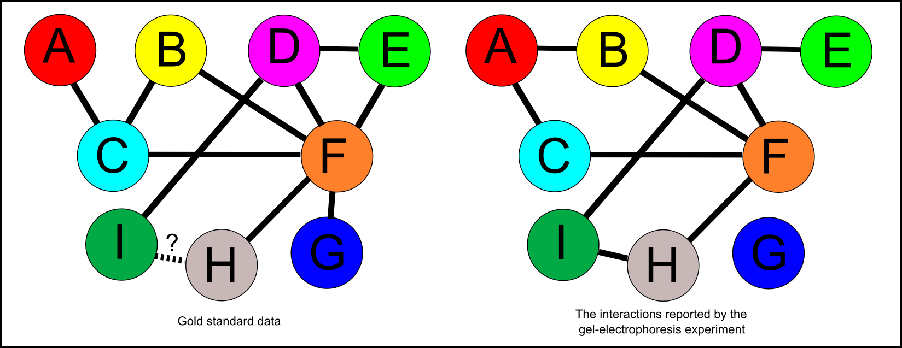
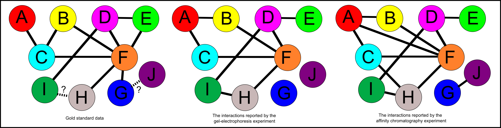
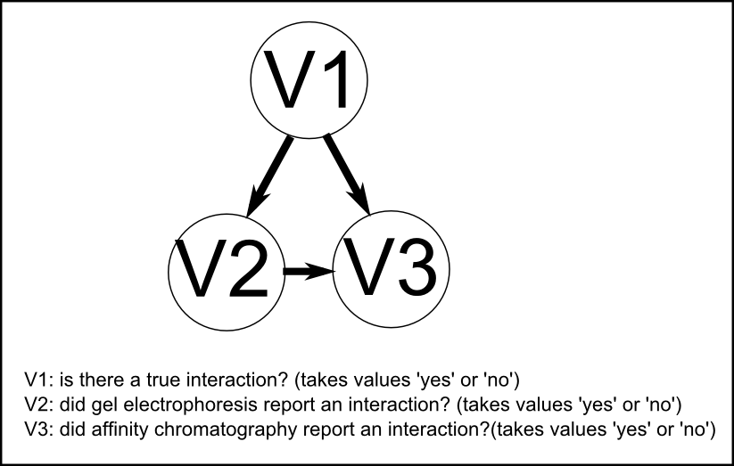

Practical 2 for 2009/2010 - Bayesian Networks for Predicting Protein-Protein Interactions
=========================================================================================

.. highlight:: r

False negatives and false positives in protein-protein interaction data
-----------------------------------------------------------------------

Many different experimental techniques are used to detect
protein-protein interactions in the contents of cells. These
include gel electrophoresis, affinity chromatography, yeast
two-hybrid screening, synthetic lethality screens, gene
coexpression studies, and mass spectroscopy.

Protein-protein interaction data that were generated using
different experimental techniques sometimes disagree. One reason
for this is that one experimental technique may detect a true
protein-protein interaction, but another technique may not be
sensitive enough to detect that interaction. This is called a
*false negative* result. Another reason why data sets may disagree
is that one experimental technique may report a protein-protein
interaction that does not actually occur, due to an experimental
artefact. This is called a *false positive* result.

For example, in a particular species, there may be a particular
three proteins that we are interested in, *Protein A*, *Protein B*,
and *Protein C*. Using a certain experimental technique (eg. gel
electrophoresis), we may try to detect interactions between these
proteins. Our experimental results report that there is an
interaction between *Protein A* and *Protein B*, and an interaction
between *Protein B* and *Protein C*.

However, in reality (unbeknownst to us), what truly occurs in the
species is that *Protein A* and *Protein C* interact, and that
*Protein B* and *Protein C* interact. In this case, our
experimental results will contain one *true positive* (the
interaction between *Protein B* and *Protein C*), one
*false positive* (the interaction between *Protein A* and
*Protein B*), and one *false negative* (the interaction between
*Protein A* and *Protein C*):

|image0|

Gold standard data
------------------

Studies have been carried out to assess the accuracy of particular
experimental techniques for detecting protein-protein interactions
(for example, gel electrophoresis). In such as study, the true
protein-protein interactions that really occur must be known, for
example, they may be worked out by applying some other technique
that is extremely accurate, but is not usually feasible to use
because it extremely labour intensive or extremely expensive. This
data that we base our knowledge of the true protein-protein
interactions on is known as the *gold standard positive data*. That
is, we assume that all the protein-protein interactions in the
*gold standard positive data* do really occur.

As well as the gold standard positive data, it is useful to also
have information on which pairs of proteins definitely do not
interact. Again, this is usually be worked out by applying some
technique that is extremely accurate, so accurate in fact that if
it does not report an interaction between a pair of proteins, we
believe that they truly do not interact. The data that we base our
knowledge of protein-protein interactions that do not occur on is
the *gold standard negative data*. We assume that the two members
of each pair of proteins in the *gold standard negative data*
really do not interact.

The gold standard positive data and gold standard negative data may
be worked out using two different extremely accurate techniques, or
the same one. The important thing, however, is that the gold
standard data is 100% accurate (or as near as possible to 100%
accurate), and that it was not generated using the technique that
we are going to use it to assess (for example, gel electrophoresis
in our example).

Using gold standard data to assess the accuracy of particular experimental techniques
-------------------------------------------------------------------------------------

If we have some gold standard data on the protein-protein
interactions between a particular set of proteins, we can use it to
assess the accuracy of some experimental technique (for example,
gel electrophoresis) in detecting those interactions.

For example, our gold standard positive data may describe the
protein-protein interactions that occur between a set of proteins,
*Protein A*, *Protein B*, *Protein C*, *Protein D*, *Protein E*,
*Protein F*, *Protein G*, *Protein H*, *Protein I* and *Protein J*.
The gold standard positive data may consist of 10 pairs of
interactions that truly occur: *A-C*, *B-C*, *B-F*, *C-F*, *D-E*,
*D-F*, *D-I*, *E-F*, *F-G* and *F-H*. We may also have gold
standard negative data describing interactions that do not occur,
for example, we may know that interactions *A-B* and *A-D* do not
occur, amongst others in our gold standard negative data.

The gold standard positive data and gold standard negative data is
assumed to be 100% correct. However, it can be incomplete. For
example, for a particular pair of proteins amongst those being
studied, for example, proteins *I* and *H*, *H-I* may not appear in
either the gold standard positive or gold standard negative data.
In other words, the gold standard data may not have information
about whether that particular pair of proteins interact. This
uncertainty is represented by showing the *H-I* link as a dotted
line with a question mark beside it in the picture below.

|image1|

Once we have gold standard data for a particular set of proteins,
we can then use it to assess the accuracy of a particular
experimental technique. For example, we may try using gel
electrophoresis to see if it could detect the true interactions,
and whether it reports any false positive interactions that don't
actually occur in reality.

Protein-protein interaction data is commonly stored in text files
in a column, where each row of the column lists an interaction
between a particular pair of proteins:

A B
B C
B F
...

For example, the file "goldpos1.txt" (which you can download from
`www.ucc.ie/microbio/goldpos1.txt <http://www.ucc.ie/microbio/MB6300/goldpos1.txt>`_)
contains all the gold standard positive data in the example shown
in the figure above.

If you download the file "goldpos1.txt" and save it in your "My
Documents" folder (where R can find it), you can then use the
function readproteinpairs() in the file "Rfunctions.R" to read in
the pairs of interacting proteins (you first need to download
"Runctions.R" from
`www.ucc.ie/microbio/MB6300/Rfunctions.R <http://www.ucc.ie/microbio/MB6300/Rfunctions.R>`_):

::

    > source("Rfunctions.R") # Read in the functions in file "Rfunctions.R"
    > goldpos1 <- readproteinpairs("goldpos1.txt") # Read in the pairs of interacting proteins in file "goldpos1.txt"
    > goldpos1 # Print out the content of vector "goldpos1"
     [1] "A~C" "B~C" "B~F" "C~F" "D~E" "D~F" "D~I" "E~F" "F~G" "F~H"
    > length(goldpos1) # Print out the length of vector "goldpos1"
    [1] 10

We may also have a second file "goldneg1.txt" (which you can
download from
`www.ucc.ie/microbio/goldneg1.txt <http://www.ucc.ie/microbio/MB6300/goldneg1.txt>`_)
containing the gold negative data, and a third file "exp1.txt"
(which you can download from
`www.ucc.ie/microbio/exp.txt <http://www.ucc.ie/microbio/MB6300/exp1.txt>`_)
containing the protein-protein interactions reported by the gel
electrophoresis experiment. We can also read these into R:

::

    > goldneg1 <- readproteinpairs("goldneg1.txt")
    > goldneg1 # Print out the content of vector "goldneg1"
     [1] "A~B" "A~D" "A~E" "A~F" "A~G" "A~H" "A~I" "B~D" "B~E" "B~G" "B~H" "B~I"
    [13] "C~D" "C~E" "C~G" "C~H" "C~I" "D~G" "D~H" "E~G" "E~H" "E~I" "F~I" "G~H"
    [25] "G~I"
    > length(goldneg1) # Print out the length of vector "goldneg1"
    [1] 25
    > exp1 <- readproteinpairs("exp1.txt")
    > exp1
    [1] "A~B" "A~C" "B~F" "C~F" "D~E" "D~F" "D~I" "F~H" "H~I"
    > length(exp1) # Print out the length of vector "exp1"
    [1] 9

We see from the above that in this example there are 10 gold
standard positive interactions and 23 gold standard negative
interactions, and that the gel electrophoresis data set being
assessed contains 9 interactions.

What is the rate of true positives and false positives for the gel
electrophoresis data? A true positive is an interaction reported by
gel electrophoresis that truly occurs, while a false positive is an
interaction that is reported by gel electrophoresis but doesn't
actually occur in the species under study. To find the number of
true positives, we can calculate the number of interactions that
are present in both the gel electrophoresis data and the gold
standard positive data. Similarly, to find out the number of
false-positives, we can calculate the number of interactions in the
gel electrophoresis data that are in the gold standard negative
data (which lists interactions which definitely don't occur).

It is also of interest to ask: what is the rate of false negatives
for the gel electrophoresis data? A false negative is a true
interaction that the gel electrophoresis misses (doesn't report).
To find the number of true negatives, we can calculate the number
of true interactions in the gold standard positive data that are
absent from the gel electrophoresis data.

You can calculate the number of true positives, false positives,
and false negatives in a particular experimental data set using the
function calcproteinpairaccuracy() from the file "Rfunctions.R". As
its input, this function requires the gold standard positive data,
the gold standard negative data and the experimental data set, for
example:

::

    > source("Rfunctions.R")
    > calcproteinpairaccuracy(goldpos1, goldneg1, exp1)
    [1] "Number of protein-protein pairs that overlap between the gold standard and experimental data: 8"
    [1] "Number of true positive pairs in the experimental data: 7 ( 87.5 % of 8 reported interactions)"
    [1] "Number of false positive pairs in the experimental data: 1 ( 12.5 % of 8 reported interactions)"
    [1] "Number of false negative pairs in the experimental data: 3 ( 30 % of 10 true interactions)"

The output from the calcproteinpairaccuracy() function tells us
that, by analysing protein-protein interaction pairs that overlap
between the gold standard data and the gel electrophoresis data, we
can calculate that 7 out of 8 of the protein-protein interaction
pairs reported in the gel electrophoresis data are true positives,
but that 1 out of 8 is a false positive (the *A-B* pair, see the
picture above). Similarly, we can calculate that 3 out of 10 of the
true interactions are false negatives, as they are missed by gel
electrophoresis (the *B-C*, *E-F*, and *F-G*, see the picture
above). This illustrates how we can assess the accuracy of data
from a particular experimental technique by using extremely
accurate gold standard negative data and gold standard positive
data (from some other source).

Finding all the experimentally reported interactions for a particular protein
-----------------------------------------------------------------------------

Once you have read in an experimental data set of protein-protein
interactions into R using the readproteinpairs() function, it is
often of interest to find out what are all the interactions that a
particular protein has. You can do this using the function
printproteininteractions() from the file "Rfunctions.R". As its
arguments (inputs), function printproteininteractions() takes the
experimental data set, and the name of the protein of interest. For
example, to find out what are the interactions of protein *D* in
data set *exp1*, you would type:

::

    > printproteininteractions(exp1, "D")
    [1] "D" "E"
    [1] "D" "F"
    [1] "D" "I"

Bayesian networks for judging the accuracy of protein-protein interactions
--------------------------------------------------------------------------

Experimental data on protein-protein interactions generated using
different techniques often disagrees. For example, we may use two
different experimental techniques (for example, gel electrophoresis
and affinity chromatography) to try to detect interactions between
a particular set of proteins of interest, and get slightly
different results.

There may be several interactions reported by the two experimental
techniques for proteins for which we have no information in our
gold standard data. For example, in the picture below, both gel
electrophoresis and affinity chromotography report an interaction
between proteins *H* and *I*, but we have no information on whether
a *H-I* interaction occurs or not in our gold standard data:

|image2|

We therefore cannot say, based on our gold standard data, whether
the *H-I* interaction occurs.

Because different experimental techniques often disagree, and are
known to miss some true interactions and report some false positive
results, it is useful to calculate a confidence value for a
particular protein-protein interaction (for example, between
*Protein I* and another protein, *Protein H*) that indicates how
confidence we are that it is true.

One method of calculating a confidence value for an interaction
between a particular pair of proteins (for example, *H* and *I* in
this example) is to use a *Bayesian network*. A Bayesian network
can integrate evidence from various different experimental data
sets of protein-protein interactions, and calculate a confidence
value for an interaction between a particular pair of proteins.

A Bayesian network can be represented as a directed graph, where
the vertices represent different variables, and the edges represent
dependence relations among the variables. For example, in a
Bayesian network for protein-protein interaction data, we may have
a vertex representing the variable *V1*, which can have values "the
protein-protein interaction is correct" or "the protein-protein
interaction is not correct. We may also have vertices *V2* and
*V3*, which can have values "the protein-protein interaction was
reported" or "the protein-protein interaction was not reported",
for two different experimental techniques, respectively. This
Bayesian network can be represented by the following directed
graph:

|image3|

The edge between the vertices representing variables *V2* and *V3*
in the graph in the picture indicates that the data in the
experimental data sets *V2* and *V3* is not totally independent.
This is often the case, as different experimental data sets
generated using the same technique, or even different experimental
data sets generated using different techniques, often are
correlated. In other words, different experimental techniques (for
example, gel electrophoresis and affinity chromatography) often
tend to make correlated errors, that is, they often miss the same
true interactions (have the same false negatives) and they often
report the same wrong interactions that do not actually occur (have
the same false positives).

A Bayesian network also includes a quantitative measure of
dependency for each of the edges representing dependence relations.
This measure of dependency is a conditional probability function,
for example, the edge joining the vertices *V1* and *V2* will have
a conditional probability function *P*(*V2* \| *V1*), the
probability of *V2* having a particular value, given that *V1* has
a particular value. Similarly, the edge joining the vertices *V1*
and *V3* will have a conditional probability function *P*(*V3* \|
*V1*). The conditional probability functions are estimated by the
Bayesian network based on gold standard positive and gold standard
negative data, which you must give to it.

The Bayesian network therefore consists of both the structure of
the graph, and the conditional probability functions for its edges.
Using the structure of the graph, and the conditional probability
functions for its edges, a Bayesian network is able to calculate a
confidence value for a particular protein-protein interaction for
which we have no information in our gold standard data (for
example, for the *H-I* interaction in the example above).

Calculating a confidence value for a protein-protein interaction
----------------------------------------------------------------

A Bayesian network can be used to calculate a confidence value for
a particular protein-protein interaction. This confidence value is
calculated by taking into account the accuracy of the experimental
technique, as assessed by comparison to the gold standard data.

The confidence value that it calculates is a ratio of two
probabilities:

-  the probability that the experimental technique(s) will give the
   observed results for a pair of proteins, given that there is truly
   an interaction between the pair of proteins. This can be written as
   *P*(*V2*, *V3* \| *V1* = 'yes').
-  the probability that the experimental technique(s) will give the
   observed results for a pair of proteins, given that there is not
   actually an interaction between the pair of proteins. This can be
   written as *P*(*V2*, *V3* \| *V1* = 'no').

The ratio of these two probabilities, that is, *P*(*V2*, *V3* \|
*V1* = 'no') / *P*(*V2*, *V3* \| *V1* = 'no') tells us how much
more likely it is that we would see the observed pattern of
experimental results if the pair of proteins really interact,
compared to if they really don't interact. This gives us a measure
of confidence in the experimentall reported protein-protein
interaction for a particular pair of proteins, and is known as the
*likelihood ratio*. If the likelihood ratio for a particular pair
of proteins is high, it means that we can be confident that they
probably truly interact, while if the likelihood ratio is low, we
are doubtful whether they interact even though the interaction may
have been reported by one or more experimental techniques.

To calculate the likelihood ratio for a particular pair of
proteins, the Bayesian network estimates the probabilities above
based on the information gathered by comparing the experimental
data to the gold standard data.

Building a Bayesian network in R for judging the accuracy of protein-protein interactions
-----------------------------------------------------------------------------------------

To build a Bayesian network in R for judging the accuracy of
protein-protein interaction networks, you can use the
bayesforproteinpairs() function in the "Rfunctions.R" file. As its
arguments (inputs), this function requires that you give it your
gold standard positive data, your gold standard negative data, a
list variable containing the experimental data of protein-protein
interactions, and the pair of proteins for which you want to
calculate a confidence value. Your experimental data (for example,
from gel electrophoresis) must overlap somewhat with the gold
standard data, but it is usual that there are many interactions
reported in the experimental data set that are not in the gold
standard (positive or negative) data:

::

    > source("Rfunctions.R") # Read in functions in file "Rfunctions.R"
    > bayesforproteinpairs(goldpos1,goldneg1,list(exp1),"H","I")
    [1] "Pair H~I confidence measure (likelihood ratio) = 17.5"

The function bayesforproteinpairs() can calculate a confidence
value (*likelihood ratio*) for each protein-protein interaction
that is found in the experimental data, but for which the gold
standard data does not have any information (that it, it is not a
gold standard positive or gold standard negative). In the example
above, the confidence value of 17.5 was calculated for the
interaction between the pair of proteins, *I* and *H*.

This confidence value is calculated taking into account the
accuracy of the experimental technique, as assessed by comparison
to the gold standard data. The likelihood ratio is calculated as
the probability that the experimental technique(s) gave the
observed results (ie. that gel electrophoresis reported an
interaction between *I* and *H* here) given that there is truly an
interaction, divided by the probabilty that the experimental
technique(s) gave the observed the results given that in reality
there is no interaction. For example, the likelihood ratio for the
*H-I* interaction is calculated as *P*(*V2* = 'yes' \| *V1* =
'yes') / *P*(*V2* = 'yes' \| *V1* = 'no').

The function bayesforproteinpairs() can be used to calculate a
confidence value for a particular protein-protein interaction by
combining the data from several different experimental techniques
(or several experiments, using the same technique). For example, to
combine the data from the gel electrophoresis and affinity
chromotography experiments shown in the picture above, you first
need to read in the affinity chromatography experimental data from
file "exp2.txt" (available at
`www.ucc.ie/microbio/MB6300/exp2.txt <http://www.ucc.ie/microbio/MB6300/exp2.txt>`_):

::

    > exp2 <- readproteinpairs("exp2.txt") # Read in the data from the second experiment
    > exp2 # Print out the data from the second experiment
     [1] "A~C" "A~B" "A~F" "B~F" "C~F" "C~H" "D~E" "D~F" "D~I" "F~H" "G~J" "H~I"

You can then use the bayesforproteinpairs() function to calculate
the confidence value for the *H-I* and *G-J* interactions, using
the gel electrophoresis and affinity chromatography data as
inputs:

::

    > bayesforproteinpairs(goldpos1,goldneg1,list(exp1,exp2),"H","I")
    [1] "Pair H~I confidence measure (likelihood ratio) = 17.5"
    > bayesforproteinpairs(goldpos1,goldneg1,list(exp1,exp2),"G","J")
    [1] "Pair G~J confidence measure (likelihood ratio) = 0"

Here a confidence value is calculated for the *H-I* interaction,
and also the *G-J* interaction that was reported by affinity
chromatography but not by gel electrophoresis. The likelihood ratio
for the *H-I* interaction is higher than that for the *G-J*
interaction. This means that we can be more confident that *H-I*
interaction is a true interaction that occurs, than we can that
*G-J* is a true interaction that occurs.

The Bayesian network bases its high confidence for *H-I* on the
fact that analysis of the gold standard data reveals that if gel
electrophoresis and affinity chromatography both report an
interaction (as in the case of *H-I*) the reported interaction is
likely to be correct. The likelihood ratio of 17.5 for *H-I* is
calculated as *P*(*V2* = 'yes', *V3* = 'yes' \| *V1* = 'yes') /
*P*(*V2* = 'yes', *V3* = 'yes' \| *V1* = 'no').

In contrast, the Bayesian network bases its low confidence in the
*G-J* on the fact that analysis of the gold standard data reveals
that if affinity chromatography reports and interaction, but it is
not reported by gel electrophoresis, it is likely to be a false
positive. The likelihood ratio of 0 for *G-J* is calculated as
*P*(*V2* = 'no', *V3* = 'yes' \| *V1* = 'yes') / *P*(*V2* = 'no',
*V3* = 'yes' \| *V1* = 'no').

Summary
-------

In this practical, you will have learnt to use the following
functions:

#. readproteinpairs() (from "Rfunctions.R") for reading in
   protein-protein interaction data
#. printproteininteractions() (from "Rfunctions.R") for printing
   the interactions of a protein in a particular experimental data set
#. calcproteinpairaccuracy() (from "Rfunctions.R") for calculating
   the accuracy of experimental protein-protein interaction data,
   based on gold standard data from another source
#. bayesforproteinpairs() (from "Rfunctions.R") for using a
   Bayesian network to calculate a confidence value (likelihood ratio)
   for a particular experimentally reported protein-protein
   interaction

Links and Further Reading
-------------------------

Some links are included here for further reading, which will be
especially useful if you need to use R or a Bayesian network for
your project or assignments.

For background reading on using Bayesian networks to calculate
confidence values for protein-protein data, it is recommended to
read Chapter 3 of
*Principles of Computational Cell Biology: from protein complexes to cellular networks*
by Volkhard Helms (Wiley-VCH;
`http://www.wiley-vch.de/publish/en/books/bySubjectLS00/ISBN3-527-31555-1 <http://www.wiley-vch.de/publish/en/books/bySubjectLS00/ISBN3-527-31555-1>`_).

For a more in-depth introduction to R, a good online tutorial is
available on the "Kickstarting R" website,
`cran.r-project.org/doc/contrib/Lemon-kickstart <http://cran.r-project.org/doc/contrib/Lemon-kickstart/>`_.

There is also a useful introduction to R in Appendix A ("A Brief
Introduction to R") of the book
*Computational genome analysis: an introduction* by Deonier, Tavaré
and Waterman (Springer).

There is another nice (slightly more in-depth) tutorial to R
available on the "Introduction to R" website,
`cran.r-project.org/doc/manuals/R-intro.html <http://cran.r-project.org/doc/manuals/R-intro.html>`_.

Acknowledgements
----------------

Many of the ideas for the examples and exercies for this practical
were inspired by the book
*Principles of Computational Cell Biology: from protein complexes to cellular networks*
by Volkhard Helms (Wiley-VCH;
`http://www.wiley-vch.de/publish/en/books/bySubjectLS00/ISBN3-527-31555-1 <http://www.wiley-vch.de/publish/en/books/bySubjectLS00/ISBN3-527-31555-1>`_).

Exercises
---------

Answer the following questions, using the R package. For each
question, please record your answer, and what you typed into R to
get this answer.

Q1. Jansen *et al* (*Science* 302: 449-453 (October 2003)) created gold standard positive data and gold standard negative data for protein-protein interactions in the yeast *Saccharomyces ecerevisiae*. Their gold standard positive data is available for download at the website `www.ucc.ie/microbio/MB6300/Jansen\_goldpos.txt <http://www.ucc.ie/microbio/MB6300/Jansen_goldpos.txt>`_ and their gold standard negative data is available for download at the website `www.ucc.ie/microbio/MB6300/Jansen\_goldneg.txt <http://www.ucc.ie/microbio/MB6300/Jansen_goldneg.txt>`_. How many interactions are in Jansen *et al*'s gold standard positive data, and how many in their gold standard negative data? 
    Note: the file "Jansen\_goldneg.txt" is very large, so make sure it
    has downloaded completely before you read it into R.
    The full paper by Jansen *et al* is available at
    `http://www.sciencemag.org/cgi/content/abstract/302/5644/449?etoc <http://www.sciencemag.org/cgi/content/abstract/302/5644/449?etoc>`_.
Q2. Jansen *et al* used their gold standard positive and gold standard negative data to assess the accuracy of two different experimental techniques for detecting protein-protein interactions, affinity chromatography, and yeast two-hybrid. They assessed one data set made using each of the two techniques. The two experimental data sets are available for download at `www.ucc.ie/microbio/MB6300/Jansen\_exp1.txt <http://www.ucc.ie/microbio/MB6300/Jansen_exp1.txt>`_ (yeast two-hybrid), and `www.ucc.ie/microbio/MB6300/Jansen\_exp3.txt <http://www.ucc.ie/microbio/MB6300/Jansen_exp3.txt>`_ (affinity chromatography). For each of the two experimental data sets, what fraction of protein-protein interactions reported in the data set are true positives? 
    What fraction of protein-protein interactions reported in each data
    set are false-positives?
    What fraction of true protein-protein interactions were missed in
    each data set (what is the fraction of false-negatives for each
    data set)?
    Based on this, which technique do you think has the highest
    *sensitivity* (has fewest false negatives), yeast two-hybrid or
    affinity chromatography?
    Which technique do you think has the highest *specificity* (has
    fewest false positives)?
    The two experimental data sets that Jansen *et al* analysed were
    data sets that had been previously published, by Uetz *et al*
    (2000) (*Nature* 403:623, yeast two-hybrid) and Gavin *et al*
    (2002) (*Nature* 415:141, affinity chromatography). The data in
    files "Jansen\_exp1.txt" and "Jansen\_exp3.txt" is not the complete
    original data sets of Uetz *et al* and Gavin *et al*, but rather
    subsets of the data that was downloaded from the IntAct database of
    protein-protein interactions
    (`http://www.ebi.ac.uk/intact <http://www.ebi.ac.uk/intact>`_).
Q3. What are the interactions reported for the *S. cerevisiae* CDK1 protein (which is given the identifier YBR160W in the *Saccharomyces* Genome Database, `http://www.yeastgenome.org <http://www.yeastgenome.org>`_) by yeast two-hybrid, and by affinity chromatography? 
    Are any of the same interactions reported by yeast two-hybrid, and
    affinity chromatography? If so, which?
    Are there any interactions reported by just yeast two-hybrid, or
    just affinity chromatography? If so, which? Which of these do you
    think is most reliable, based on your answer for Q2?
Q4. Calculate a confidence value for each of the interactions for *S. cerevisiae* CDK1 (YBR160W) that are reported by yeast two-hybrid and/or affinity chromatography. 
    What is the protein that you are most confident that yeast CDK1
    interacts with, based on the confidence value?
    What is the confidence value that you would calculate for this
    interaction, if you just had the yeast two-hybrid data? What is the
    confidence value that you would calculate for the interaction if
    you just had the affinity chromatography data? Is there a
    difference? If so, can you explain why?
    Does having both data experimental data sets allow you to be more
    confident of this interaction than you would be if you just had one
    of the data sets?
    Look up that protein in the *Saccharomyces* Genome Database,
    `http://www.yeastgenome.org <http://www.yeastgenome.org>`_. Does it
    make sense, based on what is already known about it, that it would
    interact with CDK1?
Q5. In their paper, Jansen *et al* considered that they could be confident in all reported protein-protein interactions for which they calculated a confidence value (likelihood ratio) of 300 or higher. Using this cutoff, how many confident interactions are identified for *S. cerevisiae* CDK1 in the yeast two-hybrid, and in the affinity chromatography data? 
    Look up these proteins in the *Saccharomyces* Genome Database. Are
    there any surprising high-confidence interactions reported for CDK1
    in these experimental data sets, that you think it would be
    interesting to follow up?
    The IntAct database of protein-protein interactions
    (`http://www.ebi.ac.uk/intact <http://www.ebi.ac.uk/intact>`_)
    lists all of the interactions for CDK1 in files "Jansen\_exp1.txt"
    and "Jansen\_exp3.txt". Do you think they should have included all
    of these interactions?

.. |image0| image:: ../../_static/sysbio/P2_image1.png

