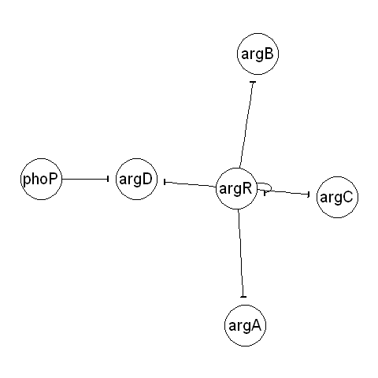
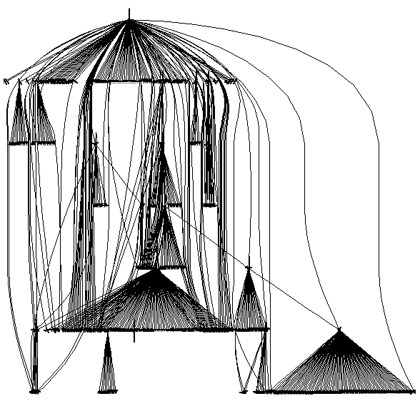

Practical 3 for 2009/2010 - Gene Regulatory Networks
====================================================

.. highlight:: r

Gene regulatory networks
------------------------

*Gene regulatory networks* describe the interactions between
transcription factor proteins and the genes that they regulate. A
gene regulatory network can be represented by a graph in which the
vertices represent transcription factors (proteins) or regulated
genes, and an edge represent a regulatory interaction between a
transcription factor and a target gene that it regulates.

A regulatory interaction may be either an *inhibitory* interaction,
where the transcription factor represses transcription of the
target gene; or an *activating* interaction, where the
transcription factor promotes transcription of the target gene.

Reading in regulatory networks into R
-------------------------------------

Just as it is possible to read in protein-protein interaction
networks in R (see Practical 1,
`http://www.ucc.ie/microbio/MB6300/practical1\_graphs.html <http://www.ucc.ie/microbio/MB6300/practical1_graphs.html>`_),
it is also possible to read in regulatory networks in R.

It is common to store data on transcription factor-target gene
regulatory relationships in a text file with three columns, where
each line of the file contains the name of a transcription factor
and a target gene that it regulates. The third column of each line
says whether the transcription factor acts to promote the target
gene's transcription (+), repress it (-), or both (+/-). For
example, such a file may look like this:
ArgR argA -
ArgR argB -
ArgR argC -
ArgR argD -
PhoP argD -
ArgR argR -
This indicates that the transcription factor ArgR regulates the
transcription of four genes, *argA*, *argB*, *argC* and *argD*, as
well as *argR* itself. Gene *argD* is regulated by two
transcription factors, ArgR, and PhoP. ArgR is a transcription
factor protein found in the bacterium *Escherichia coli* that
regulates genes that encode enzymes involved in the biochemical
pathway that makes the amino acid arginine.

The file Rfunctions.R (which you can download from
`www.ucc.ie/microbio/MB6300/Rfunctions.R <http://www.ucc.ie/microbio/MB6300/Rfunctions.R>`_)
contains a function readRegulatoryNetwork() to read in a regulatory
network based on an input file of transcription factor-target gene
interactions.

For example, the example file
`www.ucc.ie/microbio/MB6300/ExampleRegulatoryNetwork.txt <http://www.ucc.ie/microbio/MB6300/ExampleRegulatoryNetwork.txt>`_
contains the six interactions listed above. You can read it in and
make a graph of these interactions by typing:

::

    > source("Rfunctions.R")
    > thegraph <- readRegulatoryNetwork("http://www.ucc.ie/microbio/MB6300/ExampleRegulatoryNetwork.txt")
    > thegraph # Print out the information on graph "thegraph"
    A graphNEL graph with directed edges
    Number of Nodes = 6 
    Number of Edges = 6 

Plotting graphs for gene regulatory data in R
---------------------------------------------

The plotRegulatoryNetwork() function in file "Rfunctions.R" can be
used to plot a picture of all or part of a gene regulatory
network.

For example, to plot the graph *thegraph* containing the *argR*
gene and the genes that it regulates, you can type:

::

    > source("Rfunctions.R")
    > thegraph <- readRegulatoryNetwork("http://www.ucc.ie/microbio/MB6300/ExampleRegulatoryNetwork.txt")
    > plotRegulatoryNetwork(thegraph)

|image0|

This shows a directed graph with edges between *argR* and all of
the genes that it regulates. The direction of the edges represents
the fact that a transcription factor is regulating its target
genes. Furthermore, there are different types of regulatory
interactions: an edge between a transcription factor and a target
gene that it activates is shown as an arrow, while an edge between
a transcription factor and a target gene that it represses is shown
as a "T".

Note that by convention, gene names are written in Italics with the
first letter in lowercase Italics (eg. the *argR* gene), while
protein names are written with the first letter in uppercase (eg.
the ArgR protein). In a regulatory network, transcription factor
proteins interact with target genes that they regulate. However,
for simplicity, it is common to plot all the vertices in the
regulatory network as genes (including the transcription factors).
That is, the regulatory network is said to be plotted in the
*gene space*. It is implied that the person viewing the plot knows
that it is the protein encoded by a transcription factor gene that
interacts with the transcription factor's target genes. Therefore,
in the diagram shown above, the *argR* gene and the ArgR protein
(which the *argR* gene encodes) are represented by one vertex.

It is common to highlight the hierarchical nature of a gene
regulatory network by plotting the regulatory genes at the top, and
the genes that they regulate below them. We can do this by using
the "type=hierarchical" option for the plotRegulatoryNetwork()
function, for example:

::

    > plotRegulatoryNetwork(thegraph, type="hierarchical")

|image1|

RegulonDB
---------

The species with the largest amount of experimentally validated
information on regulatory interactions between transcription
factors and target genes is the bacterium *Escherichia coli* strain
K12. This bacterium is a common cause of food poisoning, and is
also widely studied as a model organism in laboratories.

The database RegulonDB
(`regulondb.ccg.unam.mx <http://regulondb.ccg.unam.mx>`_) contains
all available experimentally validated information on regulatory
interactions in *E. coli* K12. This includes data on thousands of
transcription factors and the genes that they regulate.

The file
`www.ucc.ie/microbio/MB6300/NetworkSet4.txt <http://www.ucc.ie/microbio/MB6300/NetworkSet4.txt>`_
contains interactions downloaded from RegulonDB (as of February
2010). If you download the file and save it in "My Documents", you
can then use the readRegulatoryNetwork() in file "Rfunctions.R"
function to read it in:

::

    > source("Rfunctions.R")
    > regulondbgraph <- readRegulatoryNetwork("NetworkSet4.txt")
    > regulondbgraph # Print out the information on graph "regulondbgraph"
    A graphNEL graph with directed edges
    Number of Nodes = 1543 
    Number of Edges = 3340 

When we type the name of the R variable *regulondbgraph*, it tells
us that it contains a graph with 1543 vertices and 3340 edges. The
1543 vertices represent genes, some of which encode transcription
factors, and some of which are target genes regulated by those
transcription factors.

Finding the names of genes that a particular gene interacts with
----------------------------------------------------------------

If you want to know which genes that a particular gene (or the
protein it encodes) interacts with, you can use the adj() function
in the R "graph" library (just as for protein-protein interaction
graphs, see Practical 1,
`http://www.ucc.ie/microbio/MB6300/practical1\_graphs.html <http://www.ucc.ie/microbio/MB6300/practical1_graphs.html>`_).

In the case of an undirected graph (for example, a protein-protein
interaction graph), the adj() function tells you all the nodes that
are connected to your node of interest.

In contrast, for a directed graph (such as a gene regulatory
network), the adj() function gives you all nodes that are connected
to your node of interest by directed edges that start at the node
of interest and end at the other node.

For example, to find the names of all the genes that the *argR*
gene (or ArgR protein) interacts with in the *regulondbgraph*
network, we type:

::

    > library("graph")
    > adj(regulondbgraph, "argR")
    $argR
     [1] "argA" "argB" "argC" "argD" "argE" "argF" "argG" "argH" "argI" "argR" "artI" "artJ"
    [13] "artM" "artP" "artQ" "astA" "astB" "astC" "astD" "astE" "carA" "carB" "gltB" "gltD"
    [25] "gltF" "hisJ" "hisM" "hisP" "hisQ" "infB" "metY" "nusA" "pnp"  "rbfA" "rimP" "rpsO"
    [37] "truB"

This tells us in fact the *argR* gene (or ArgR protein) interacts
with 37 other genes (or the proteins they encode) in *E. coli* K12.
The adj() function gives only nodes that are connected to *argR* by
directed edges that start at the *argR* node. Therefore, this tells
us that the ArgR protein regulates 37 other genes.

Note that the adj() function returns an R list variable that has a
named element called "argR". The "argR" named element is a vector
containing the names of the vertices linked to the vertex of
interest. As you learnt in MB6301 practical 1, you can access the
values stored in a named element of a list variable by typing the
list variable name, followed by "$", followed by the name of the
named element. Therefore, to access the vector containing the names
of vertices linked to the *argR* gene's vertex, we can type:

::

    > nodenames <- adj(regulondbgraph, "argR")
    > nodenames$argR
    "argA" "argB" "argC" "argD" "argE" "argF" "argG" "argH" "argI" "argR" "artI" "artJ"
    [13] "artM" "artP" "artQ" "astA" "astB" "astC" "astD" "astE" "carA" "carB" "gltB" "gltD"
    [25] "gltF" "hisJ" "hisM" "hisP" "hisQ" "infB" "metY" "nusA" "pnp"  "rbfA" "rimP" "rpsO"
    [37] "truB"

Finding all the descendents of a particular gene
------------------------------------------------

As discussed above, you can use the adj() function to find all the
target genes regulated by a particular protein in a gene regulatory
network. What about if some of those target genes in turn regulate
other genes?

For example, a particular transcription factor *A* may regulate
several genes *B*, *C* and *D*. One of these genes *C* may itself
encode a transcription factor, which regulates other target genes
*E* and *F*. In this case, we can say that genes *B*, *C*, *D*, *E*
and *F* are all descendents of gene *A* in the regulatory network.

To find the descendents of a particular gene (or more correctly,
the protein it encodes) in a regulatory network, you can use the
function getdescendents() in file "Rfunctions.R". For example, the
transcription factor Hns is a global regulator in *E. coli*. To
retrieve the names of all the genes that Hns directly regulates, we
can use the adj() function:

::

    > nodenames2 <- adj(regulondbgraph, "hns")
    > nodenames2$hns # Print out all the genes regulated by HNS
      [1] "acrE" "acrF" "adiA" "alaU" "alaV" "appY" "asr"  "bglB" "bglF" "bglG"
     [11] "bglJ" "bolA" "cadA" "cadB" "caiF" "chiA" "chpA" "chpR" "csiD" "csiE"
     [21] "cspD" "cydA" "cydB" "cysA" "cysG" "cysM" "cysP" "cysU" "cysW" "degP"
     [31] "dps"  "entF" "fepE" "fes"  "fimA" "fimB" "fimC" "fimD" "fimE" "fimF"
     [41] "fimG" "fimH" "fimI" "flhC" "flhD" "fliA" "fliC" "fliY" "fliZ" "gabD"
     [51] "gabP" "gabT" "gadA" "gadW" "gadX" "galE" "galK" "galM" "galT" "garK"
     [61] "garL" "garP" "garR" "gltT" "gltU" "gltW" "gspA" "gspB" "gspC" "gspD"
     [71] "gspE" "gspF" "gspG" "gspH" "gspI" "gspJ" "gspK" "gspL" "gspM" "gspO"
     [81] "gutM" "gutQ" "hchA" "hdeA" "hdeB" "hdeD" "hisJ" "hisM" "hisP" "hisQ"
     [91] "hlyE" "hns"  "ileU" "ileV" "ilvH" "ilvI" "lacA" "lacY" "lacZ" "leuO"
    [101] "lhgO" "micF" "mukB" "mukE" "mukF" "nhaA" "nhaR" "nirB" "nirC" "nirD"
    [111] "osmC" "proV" "proW" "proX" "rcsA" "relA" "rnpB" "rrfB" "rrfC" "rrfD"
    [121] "rrfF" "rrfG" "rrfH" "rrlB" "rrlC" "rrlD" "rrlG" "rrlH" "rrsB" "rrsC"
    [131] "rrsD" "rrsG" "rrsH" "smtA" "sodB" "srlA" "srlB" "srlD" "srlE" "srlR"
    [141] "stpA" "thrV" "ybdZ" "yciE" "yciF" "yciG" "yhiD" "yjjP" "yjjQ"
    > length(nodenames2$hns) # Get the number of genes regulated by HNS
    [1] 149

This tells us that Hns directly regulates 149 genes (one of which
is the *hns* gene itself, if we look at the list above.

Among the genes that Hns regulates, there are several other
transcription factors. We can find all the descendents of *hns* in
the gene regulatory network by typing:

::

    > descendents <- getdescendents(regulondbgraph,"hns")
    > length(descendents) # Get the number of genes below Hns in the regulatory network
    [1] 371

This tells us that although Hns only directly regulates 149 genes,
there are 371 genes below Hns in the gene regulatory network. This
is because some of the genes that Hns directly regulates encode
transcription factors that regulate other genes (some of which may
also encode transcription factors, and so regulate other genes). In
other words, Hns has 371 descendents in the gene regulatory
network, including the *hns* gene itself.

You can use the plotRegulatoryNetwork() function to plot the
subgraph containing the *hns* gene and all its descendents in the
*E. coli* K12 gene regulatory network. To do this, you need to use
the "nodes" option in the plotRegulatoryNetwork() function to
specify the names of the verices that you want to include in your
plot. For example, to make a plot of the *hns* gene and its
descendents in the *E. coli* K12 gene regulatory network, we type:

::

    > descendents <- getdescendents(regulondbgraph,"hns")
    > plotRegulatoryNetwork(regulondbgraph, nodes=descendents, type="hierarchical")

|image2|

This shows the *hns* gene at the top of the subgraph, and the genes
it regulates at the next level below, and genes that they regulate
at the next level below, and so on. We see there are actually seven
layers in the hierarchy of genes that *hns* regulates, and it also
regulates itself. The image is too small to see the names of the
genes, or the direction of the edges, but it does give us an idea
of the overall structure of the subgraph of the regulatory network
below *hns*.

Finding motifs in a gene regulatory network using R
---------------------------------------------------

Gene regulatory networks often contain a small set of recurring
regulation patterns called *network motifs*. Network motifs are the
basic circuits of regulatory interactions from which gene
regulatory networks are built.

To identify what motifs occur in a gene regulatory network, you can
use the findnetworkmotifs() function in the "Rfunctions.R" file. As
its arguments (inputs), the function findnetworkmotifs() requires
the variable containing the graph, the size of the motifs to look
for (that is, the number of vertices in each motif), and the
minimum number of occurrences of a motif for it to be reported. At
present, findnetworkmotifs() can only look for motifs with 3 or 4
vertices.

For example, to find motifs containing 3 vertices each that occur
at least 100 times in the subgraph that contains the *hns* gene and
its descendents, you can type:

::

    > descendents <- getdescendents(regulondbgraph, "hns") 
    > length(descendents) # Find out how many descendents Hns has
    [1] 371
    > mysubgraph <- subGraph(descendents, regulondbgraph) # Get the subgraph of the hns gene and its descendents
    > mysubgraph                                          # Print out information on the subgraph
    A graphNEL graph with directed edges
    Number of Nodes = 371 
    Number of Edges = 505 
    > findnetworkmotifs(mysubgraph, 3, min=100)           # Find motifs that occur at least 100 times
    [1] "This motif occurs 19548 times:"
    Edge sequence:
              
    [0] 2 -> 1
    [1] 2 -> 0
    [1] "This motif occurs 348 times:"
    Edge sequence:
              
    [0] 0 -> 1
    [1] 2 -> 0
    [1] "This motif occurs 213 times:"
    Edge sequence:
              
    [0] 0 -> 2
    [1] 0 -> 1
    [2] 1 -> 0

This tells us that the subgraph consisting of the *hns* gene and
its descendents contains 19,548 occurrence of a motif of size 3
(ie. patterns in the subgraph that involve 3 vertices) that
contains a particular gene *gene 2* that regulates two other genes
*gene 1* and *gene 0*.

It also contains 348 occurrences of a motif of size 3 that contains
a particular gene *gene 2* that regulates a gene *gene 0*, where
*gene 0* itself regulates a third gene *gene 1*.

Furthermore, it contains 213 occurrences of a motif of size 3 of a
particular gene *gene 0* that regulates two other genes *gene 2*
and *gene 1*, where *gene 1* actually regulates *gene 0*.

Summary
-------

In this practical, you will have learnt to use the following
functions:

#. readRegulatoryNetwork() (from "Rfunctions.R") for reading in
   regulatory network data
#. plotRegulatoryNetwork() (from "Rfunctions.R") for plotting all
   or part of a regulatory network
#. adj() from the "graph" library for finding the nodes that a
   particular node is linked to in a graph
#. getdescendents() (from "Rfunctions.R") for finding the
   descendents of a gene in a gene regulatory network
#. findnetworkmotifs() (from "Rfunctions.R") for finding motifs in
   a gene regulatory network

Links and Further Reading
-------------------------

Some links are included here for further reading, which will be
especially useful if you need to use R or analyse a gene regulatory
network for your project or assignments.

For background reading on gene regulatory networks, it is
recommended to read Chapter 5 of
*Principles of Computational Cell Biology: from protein complexes to cellular networks*
by Volkhard Helms (Wiley-VCH;
`http://www.wiley-vch.de/publish/en/books/bySubjectLS00/ISBN3-527-31555-1 <http://www.wiley-vch.de/publish/en/books/bySubjectLS00/ISBN3-527-31555-1>`_).

For a more in-depth introduction to R, a good online tutorial is
available on the "Kickstarting R" website,
`cran.r-project.org/doc/contrib/Lemon-kickstart <http://cran.r-project.org/doc/contrib/Lemon-kickstart/>`_.

There is also a useful introduction to R in Appendix A ("A Brief
Introduction to R") of the book
*Computational genome analysis: an introduction* by Deonier, Tavaré
and Waterman (Springer).

There is another nice (slightly more in-depth) tutorial to R
available on the "Introduction to R" website,
`cran.r-project.org/doc/manuals/R-intro.html <http://cran.r-project.org/doc/manuals/R-intro.html>`_.

For more in-depth information and more examples on using the
"graph" library for analysing graphs, look at the "graph" library
documentation,
`www.cran.r-project.org/web/packages/graph/index.html <http://www.cran.r-project.org/web/packages/graph/index.html>`_.

More information and examples on using the "RBGL" library is
available in the RBGL documentation at
`www.cran.r-project.org/web/packages/RBGL/index.html <http://www.cran.r-project.org/web/packages/RBGL/index.html>`_.

More information and examples on using the "Rgraphviz" library is
available in the Rgraphviz documentation at
`www.bioconductor.org/packages/release/bioc/html/Rgraphviz.html <http://www.bioconductor.org/packages/release/bioc/html/Rgraphviz.html>`_.

More information and examples on using the "igraph" library is
available in the "igraph" documentation at
`www.cran.r-project.org/web/packages/igraph/index.html <http://www.cran.r-project.org/web/packages/igraph/index.html>`_.

There are also very useful chapters on "Using Graphs for
Interactome Data" and "Graph Layout" in the book
*Bioconductor Case Studies* by Florian Hahne, Wolfgang Huber,
Robert Gentleman and Seth Falcon
(`http://www.bioconductor.org/pub/biocases/ <http://www.bioconductor.org/pub/biocases/>`_).

Acknowledgements
----------------

Many of the ideas for the examples and exercies for this practical
were inspired by the book
*Principles of Computational Cell Biology: from protein complexes to cellular networks*
by Volkhard Helms (Wiley-VCH;
`http://www.wiley-vch.de/publish/en/books/bySubjectLS00/ISBN3-527-31555-1 <http://www.wiley-vch.de/publish/en/books/bySubjectLS00/ISBN3-527-31555-1>`_).

Exercises
---------

Answer the following questions, using the R package. For each
question, please record your answer, and what you typed into R to
get this answer.

Q1. As you learnt in practical 1, the graph::degree() function from the "graph" library can be used to calculate the degree distribution for a graph. If you have a directed graph (as in the case of gene regulatory) networks, the graph::degree() function returns a list with two named elements called "inDegree" and "outDegree", both of which are vectors containing the number of incoming edges and outgoing edges for each vertex. Plot the in-degree and out-degree distributions for the *E. coli* K12 gene regulatory network. 
    Do you see a difference between the shapes of the in-degree and
    out-degree distributions? Can you explain why?
Q2. Can you identify the 8 transcription factors that regulate the most genes in the *E. coli* K12 gene regulatory network? 
    How many target genes do each of these transcription factors
    regulate?
    Hint: this is similar to the problem of finding the "hubs" in a
    protein-protein interaction network, which you did in practical 1
    (`http://www.ucc.ie/microbio/MB6300/practical1\_graphs.html <http://www.ucc.ie/microbio/MB6300/practical1_graphs.html>`_.
Q3. *E. coli* K12 is estimated to have approximately 4300 genes. When you take all the target genes of the 8 global regulators that you identified in Q2, what fraction of all *E. coli* genes do they directly regulate (*direct regulation* means there is an edge between the global regulator and the target gene in the gene regulatory network)? 
    Hint: if you have two vectors *V1* and *V2* in R, you can make a
    new vector *V3* containing the union of their elements by using the
    union() function (for example, V3 <- union(V1, V2)).
Q4. What fraction of *E. coli* genes do the 8 global regulators (that you identified in Q2) indirectly regulate (*indirect regulation* means that the target genes are descendents of the global regulators, although there may not be an edge between any of the global regulators and a particular target gene)? Q5. What are the five most common motifs of size 3 (containing 3 vertices) that occur in the *E. coli* K12 gene regulatory network, and how many times do they occur? 
    Do you recognise any of the motifs as those identified by Uri Alon
    and colleagues as being particularly frequent in gene regulatory
    networks?
Q6. Make a random graph with the same number of vertices and edges as the *E. coli* K12 gene regulatory network. What are the five most common motifs of size 3 in the random graph, and how many times do they occur? 
    Are they the same or different as those in the *E. coli* gene
    regulatory network?
    Hint: see practical 1 for how to generate a random graph according
    to the Erdos-Renyi model
    (`http://www.ucc.ie/microbio/MB6300/practical1\_graphs.html <http://www.ucc.ie/microbio/MB6300/practical1_graphs.html>`_).

.. |image1| image:: ../../_static/sysbio/P3_image4.png

