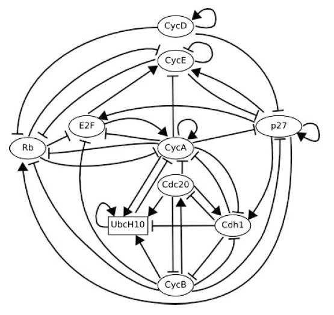
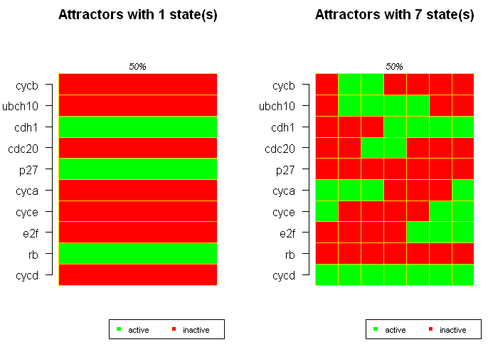
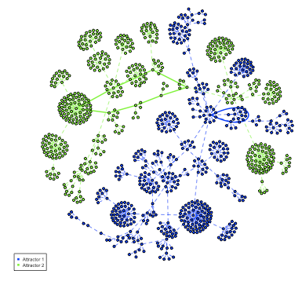

Practical 4 for 2009/2010 - Boolean Networks
============================================

.. highlight:: r

Boolean Networks
----------------

A *Boolean network* can be used to model changes in a gene
regulatory network over time. In a Boolean network, each of the
vertices represents a gene, and each gene can have two values, "ON"
or "OFF", according to whether the gene is currently transcribed or
not at a particular point in time. At any one point in time, some
of the vertices in the network may have values of "ON", and others
may have values of "OFF".

In a Boolean network, the edges between vertices are directed, and
represent regulatory interactions between transcription factors and
their target genes. The value that a particular vertex has a
particular point in time (that is, "OFF" or "ON") depends on the
values that its parent vertices in the network have (that is,
whether the vertices representing the transcription factors that
regulate it have values "OFF" or "ON").

For example, it is possible to model the gene regulatory
interactions that occur during the human cell cycle as a Boolean
network. The cell cycle consists of several phases that must occur
in order: G1, S, G2 and M phases. This image from Faure *et al*
(2006, *Bioinformatics* 22:e124-e131, see
`http://bioinformatics.oxfordjournals.org/cgi/content/abstract/22/14/e124 <http://bioinformatics.oxfordjournals.org/cgi/content/abstract/22/14/e124>`_)
shows the vertices and edges in the network:

|image0|

This network represents the human genes involved in the cell cycle
as a directed graph, with edges between transcription factors (eg.
E2F) and the genes that they regulate, or between proteins (eg.
CycD, p27, Rb, CycE) and other proteins that they activate or
inactivate. At any particular point in the cell cycle some of the
genes will be transcribed (some vertices will have "ON" values) and
some will not be transcribed (some vertices will have "OFF"
values).

The values that all the vertices in a Boolean network have at a
particular point in time represent the *state* of the network at
that point in time. For example, at a particular point in time, the
vertex representing *gene 1* may have value "ON", the vertex
representing *gene 2* have value "OFF", the vertex representing
*gene 3* have value "ON", and the vertex representing *gene 4* have
value "ON".

Boolean Transition functions
----------------------------

The values of all the nodes in a Boolean network are updated at the
same time according to *Boolean transition functions*. The Boolean
transition function for a particular node describes how its state
at time *t* + 1 depends on the states of those nodes to which it is
connected at time *t*. That is, if there are directed edges in the
network from nodes *Y* and *Z* to node *X*, then the Boolean
transition function for node *X* will describe how its value at
time *t* + 1 depends on the values of nodes *Y* and *Z* at time
*t*.

Each node in a Boolean network has its own Boolean transition
function. Given Boolean transition functions for all states, the
state at time *t* + 1 can be predicted with 100% accuracy based on
the state at time *t*. When the states of all nodes are updated,
this is called a *state transition* of the network. The state
transition is a model of what changes occur in the network when one
unit of time passes, that is, the changes that occur between a
particular time *t* and the next moment in time, time *t* + 1.

For example, in the regulatory network for the human cell cycle
(see image above), the CycB protein is inactivated by two proteins,
Cdc20 and Cdh1. As a result, the Boolean transition function for
the vertex representing CycB will say how the value of that vertex
at time *t* + 1 depends on the values of the vertices representing
Cdc20 and Cdh1 and time *t*. As you can image, if the vertices
representing Cdc20 and Cdh1 have values "ON" at time *t*, then the
vertex representing CycB will have value "OFF" at time *t* + 1.

Boolean Logic
-------------

The Boolean transition function for a vertex is often given in
terms of *Boolean logic*, using the *Boolean operators* "AND",
"NOT" and "OR". The meaning of "AND", "NOT" and "OR" are quite
different in Boolean logic than in ordinary English conversation.
The "AND" Boolean operator can be thought of as finding the
intersection of its inputs, while the "OR" Boolean operator can be
thought of as finding the union of its inputs.

For example, if we have two Boolean variables *X* and *Y* that can
have values of "OFF" or "ON", then the Boolean "AND" operator will
only have a value of "ON" if both of the input variables also have
values of "ON". That is, ***X* AND *Y*** (i) is only equal to "ON"
if both *X* and *Y* have values of "ON", (ii) is equal to "OFF"
otherwise.

On the other hand, ***NOT X* AND *NOT Y*** (i) is only equal to
"ON" if both *X* and *Y* have values of "OFF", (ii) is equal to
"OFF" otherwise.

Furthermore, ***NOT X* AND *Y*** (i) is only equal to "ON" if *X*
has a value of "OFF" and *Y* has a value of "ON", (ii) is equal to
"OFF" otherwise.

In contrast, if we have two Boolean variables *X* and *Y* that can
have values of "OFF" or "ON", then the Boolean "OR" operator will
have a value of "ON" if either of the input values has a value of
"ON". That is, ***X* OR *Y*** (i) is equal to "ON" if either *X* or
*Y* has a value of "ON", (ii) is equal to "OFF" otherwise.

The Attractors of a Boolean Network
-----------------------------------

A series of state transitions in a Boolean network represents the
passing of several units of time (eg. seconds), and is called a
*trajectory*.

There is a finite number of network states for a Boolean network.
That is, if there are *n* vertices, each vertex can be 'ON'/'OFF',
so there are 2^*n* possible network states.

If a particular state is visited a second time by the network, it
will then take exactly the same path as for the first time. This is
because the state at time *t* + 1 can be predicted with 100%
accuracy based on the state at time *t*, so if a state is visited a
second time, the trajectory will take exactly the same path after
that as it did the first time it visited the state.

In other words, the trajectories in a Boolean network are periodic,
that is, they follow the same series of state transitions over and
over again. The repeating parts of the trajectories are called
*attractors* and can be one or more state trates long.

A *fixed-point attractor* is an attractor that consists of a just 1
state. If the network reaches a fixed-point attractor, it stays
there for many time-steps in a row (times *t*, *t* + 1, *t* + 2,
etc.) In terms of gene regulatory networks, a fixed-point attractor
is a stable gene expression state. In such a state, genes will tend
to remain "OFF" if they are already "OFF" and will tend to remain
"ON" if they are "ON" already.

Using a Boolean Networks to Model the Human Cell Cycle in R
-----------------------------------------------------------

The R "BoolNet" library can be used to model a gene regulatory
network as a Boolean network.

The Boolnet library comes with an example data set called
"cellcycle" for the human cell cycle. This data set comes from a
paper by Faure *et al* (2006), who modelled the human cell cycle
using a Boolean network (Faure *et al* (2006) *Bioinformatics*
22:e124-e131,
`http://bioinformatics.oxfordjournals.org/cgi/content/short/22/14/e124 <http://bioinformatics.oxfordjournals.org/cgi/content/short/22/14/e124>`_).
You can load their human cell cycle data into R by using the data()
function:

::

    > install.packages("BoolNet") # Install the BoolNet library
    > library("BoolNet")          # Load up the BoolNet library
    > data(cellcycle)             # Read in the "cellcycle" data set

The last command reads the cell cycle network into a variable
called *net*.

You can print out the Boolean transition functions for all vertices
in this network by just typing the name of the variable *net*:

::

    > net                         # Print out the Boolean functions for the network
    Boolean network with 10 genes
    
    Involved genes:
    cycd rb e2f cyce cyca p27 cdc20 cdh1 ubch10 cycb
    
    Transition functions:
    cycd = cycd
    rb = (!cycd & !cyce & !cyca & !cycb) | (p27 & !cycd & !cycb)
    e2f = (!rb & !cyca & !cycb) | (p27 & !rb & !cycb)
    cyce = (e2f & !rb)
    cyca = (e2f & !rb & !cdc20 & !(cdh1 & ubch10)) | (cyca & !rb & !cdc20 & !(cdh1 & ubch10))
    p27 = (!cycd & !cyce & !cyca & !cycb) | (p27 & !(cyce & cyca) & !cycb &!cycd)
    cdc20 = cycb
    cdh1 = (!cyca & !cycb) | (cdc20) | (p27 & !cycb)
    ubch10 =  !cdh1 |(cdh1 & ubch10 & (cdc20 | cyca |cycb))
    cycb =  !cdc20 & !cdh1

This tells us that there are 10 genes in this Boolean network. It
also gives the Boolean transition function for the vertex
representing each gene (or the protein it encodes). The Boolean
transition function for a node *Z* tells you how the value of that
node at time *t* + 1 depends on the values of the nodes to which it
is connected (by directed edges arriving at *Z*) at time *t*.

The Boolean transition function is given in terms of Boolean logic,
in which "!" means "NOT", and "\|" means "OR", and "&" means
"AND".

For example, the Boolean transition function for the vertex
representing protein CycB, is given as **cycb = !cdc20 & !cdh1**.
This means that the value at time *t* + 1 of the vertex
representing CycB (i) is only equal to "ON" if the vertices both
representing Cdc20 and Cdh1 have values of "OFF" at time *t* (ii)
is equal to "OFF" otherwise. This makes sense, since the regulatory
network for the human cell cycle shows that the Cycb protein is
deactivated by both Cdc20 and Cdh1 (see the picture above), so
presumably Cycb will only become active when both Cdc20 and Cdh1
are absent or unactive.

The Boolean transition function for the vertex representing CycE is
**cyce = (ef2 & !rb)**. This means that the value of vertex CycE at
time *t* + 1 (i) is only equal to "ON" if the vertex representing
Ef2 has value "ON" and the vertex representing Rb has value "OFF"
at time *t*, (ii) is equal to "OFF" otherwise. Again, this makes
sense, as the regulatory network (see picture above) shows that
CycE is activated by Ef2 and inhibited by Rb. Therefore, CycE will
presumably only become active when Ef2 is active and Rb is
absent/inactive.

Finding the Attractors of a Boolean Network Using R
---------------------------------------------------

You can find the attractors (repeating parts of the trajectories)
for a Boolean network by using the getAttractors() function in the
"BoolNet" library. For example, to find the attractors (repeating
parts of the trajectories) for the cell cycle Boolean network, you
can type:

::

    > attractors <- getAttractors(net, canonical=TRUE)
    > attractors 
    Attractor 1 consists of 1 state(s) and has a basin of 512 state(s):
    
    Genes are encoded in the following order: cycd rb e2f cyce cyca p27 cdc20 cdh1 ubch10 cycb
    
     |--<---------|
     V            |
     0100010100   |
     |            |
     V            |
     |-->---------|
    
    Attractor 2 consists of 7 state(s) and has a basin of 512 state(s):
    
    Genes are encoded in the following order: cycd rb e2f cyce cyca p27 cdc20 cdh1 ubch10 cycb
    
     |--<---------|
     V            |
     1001100000   |
     |            |
     1000100011   |
     |            |
     1000101011   |
     |            |
     1000001110   |
     |            |
     1010000110   |
     |            |
     1011000100   |
     |            |
     1011100100   |
     |            |
     V            |
     |-->---------|

This shows that there are two attractors, one consisting of just
one state (a fixed-point attractor), and one consisting of a cycle
of seven states. The values at the vertices representing the ten
genes are given as 1s and 0s for each state, where 1 means "ON" and
0 means "OFF". Therefore, in the first attractor the state is
0100010100, which means that just the 2nd, 6th and 8th genes are
"ON", which are the genes for *rb*, *p27* and *cdh1*.

The function plotBooleanAttractors() in file "Rfunctions.R") can
then be used to plot the attractors:

::

    > source("Rfunctions.R")
    > plotBooleanAttractors(attractors)

|image1|

This image shows that there are two attractors in the Boolean
network for the human cell cycle. The first attractor (on the left)
has just one state, that it, it's a fixed-point attractor. In this
state, the vertices for Cdh1, P27, and Rbare "ON", and all other
vertices have values of "OFF". In this state the *cycd* (cyclin D)
gene is turned "OFF", and it corresponds to the "G0" phase of the
cell cycle, when the cell is in a resting state (ie. before the
cell cycle starts).

The cell will eventually leave this state when growth factors cause
the *cycD* (cyclin D) gene to be transcribed, causing the cell to
change from "G0" phase to "G1" phase of the cell cycle.

The second attractor (on the right) consists of seven states. In
the first state the genes CycA, CycE and CycD are "ON". The CycD
node has value "ON" throughout the next seven states of the
attractor. The order of activity (switching "ON" or "OFF" of
proteins) corresponds to what is known about the changes that occur
to the proteins in the human cell cycle regulatory network over the
course of the G1, S, G2 and M phases of the cell cycle. The
attractor represents the cycle of events that occur during one
complete cell cycle. However, the first state in the attractor
doesn't actually correspond to the first state in the cell cycle:
in fact, the third last state of the attractor roughly corresponds
to the beginning of the cell cycle.

For example, in the human cell cycle, at the time of the transition
from G1 phase to S phase, the transcription factor E2F activates
the transcription of the *cyclin E* gene, causing production of the
Cyclin E protein. In the second attractor, you can see that E2F
first becomes "ON" (green in the picture) in the third last state
of the attractor, in which Cyclin E is "OFF". In the second last
state of the attractor, Cyclin E then becomes "ON". Thus, the third
and second last states of the attractor capture regulatory changes
that occur during the G1/S transition of the human cell cycle.

On the other hand, at the time of the G2 to M phase transition of
the human cell cycle, the CycA protein inactivates Cdh1. We can see
in the second last state of the attractor that CycA is "OFF" and
Cdh1 is "ON". However, in the last state of the attractor, CycA
turns "ON", while Cdh1 remains "ON". As a result, in the next
(first) state of the attractor, CycA is still "ON" but Cdh1 turns
"OFF", presumably because CycA has inactivated Cdh1.

Examining the State Transitions in a Boolean Network using R
------------------------------------------------------------

As mentioned above, given the state of a Boolean network at time
*t*, the state of the network at time *t* + 1 can be predicted with
100% accuracy. In R, you can find out the state transition that
will occur next in the network for a particular current state by
using the stateTransition() function from the BoolNet library.

For example, to know what state transition will occur next, when
the current state of the network is that all genes are turned "ON"
(encoded as 1s), we type:

::

    > stateTransition(net,c(1,1,1,1,1,1,1,1,1,1))
     [1] 1 0 0 0 0 0 1 1 1 0

This means that if every gene in the network is "ON" at time *t*,
at time *t* + 1, the 1st, 7th, 8th and 9th genes will be "ON" and
the other genes will be "OFF". The output from the getAttractors()
function told us that the genes are encoded in the following order
in this network: *cycd*, *rb*, *e2f*, *cyce*, *cyca*, *p27*,
*cdc20*, *cdh1*, *ubch10* and *cycb*. Thus, the 1st, 7th, 8th and
9th genes are *cycd*, *cdc20*, *cdh1* and *ubch10*.

Why does having all genes "ON" at time *t* lead to only CycD,
Cdc20, Cdh1 and Ubch10 being "ON" at time *t* + 1? If you look at
the picture showing the regulatory network, you'll see that this
makes sense because CycD inhibits p27 and Rb; Cdc20 and Cdh1 both
inhibit CycA and CycB; and Ubch10 inhibits CycA. Thus, the state
transition that occurs can be understood somewhat intuitively by
looking at the picture of the network.

However, to fully understand the state transition that occurs, you
need to look at the Boolean transition function for each gene. For
example, to understand what will be the value of the E2F vertex at
time *t* + 1 if the values of all other vertices at time *t* are
"ON", we need to look at the Boolean transition function for the
E2F vertex (by typing *net*):

::

    > net
    Transition functions:
    cycd = cycd
    rb = (!cycd & !cyce & !cyca & !cycb) | (p27 & !cycd & !cycb)
    e2f = (!rb & !cyca & !cycb) | (p27 & !rb & !cycb)
    cyce = (e2f & !rb)
    cyca = (e2f & !rb & !cdc20 & !(cdh1 & ubch10)) | (cyca & !rb & !cdc20 & !(cdh1 & ubch10))
    p27 = (!cycd & !cyce & !cyca & !cycb) | (p27 & !(cyce & cyca) & !cycb &!cycd)
    cdc20 = cycb
    cdh1 = (!cyca & !cycb) | (cdc20) | (p27 & !cycb)
    ubch10 =  !cdh1 |(cdh1 & ubch10 & (cdc20 | cyca |cycb))
    cycb =  !cdc20 & !cdh1

This tells us that the the value of the E2F vertex at time *t* + 1
will be (i) "ON" if Rb and CycA and CycB are all "OFF" at time *t*,
or if P27 is "ON" and CycD and CycB are "OFF" at time *t*, (ii)
"OFF" otherwise. Thus, in the situation where all vertices are "ON"
at time *t*, this means that at time *t* + 1 the E2F vertex will be
"OFF". Thus, we can understand why a particular state transition
occurs when we look at the Boolean transition function for a
vertex.

We can then ask what is the state transition that will occur next,
once the network has reached state 1000001110:

::

    > stateTransition(net,c(1,0,0,0,0,0,1,1,1,0))
     [1] 1 0 1 0 0 0 0 1 1 0

That is, in the next state of the network, the 1st, 3rd, 8th and
9th genes are on, which are CycD, E2F, Cdh1 and Ubch10. Why is E2F
on at time *t*, when only CycD, Cdc20, Cdh1, and Ubch10 were "ON"
at time *t*? We can understand this if we look again at the Boolean
transition function for the E2F vertex, which says that E2F will be
on at time *t* + 1 if Rb and CycA and CycB are all "OFF" at time
*t*.

The Basin of Attraction for an Attractor
----------------------------------------

Eventually, if you keep looking at which state occurs after each
state, the network will enter one of the two attractors above. How
many states away from the attractor is our current state
1010000110? To find this out, you can use the getStateSummary()
function from the BoolNet library:

::

    > getStateSummary(attractors,c(1,0,1,0,0,0,1,1,1,0))
         State      Next state  Attr. basin  # trans. to attr.
    1010001110 =>   1011000110            2                  2

This tells us that the next state transition will be to state
1011000110. Furthermore, there are 2 transitions to undergo to end
up in the "Attractor 2" series of states (the attractor consisting
of 7 states). Let's see what those transitions are:

::

    > getStateSummary(attractors,c(1,0,1,1,0,0,0,1,1,0))
         State      Next state  Attr. basin  # trans. to attr.
    1011000110 =>   1011000100            2                  1

Now we have one transition left to get to the attractor:

::

    > getStateSummary(attractors,c(1,0,1,1,0,0,0,1,0,0))
         State      Next state  Attr. basin  # trans. to attr.
    1011000100 =>   1011100100            2                  0

If you look at the states in "Attractor 2" above, you will see that
1011100100 is actually the last state in the attractor. What
happens after this state?

::

    > getStateSummary(attractors,c(1,0,1,1,1,0,0,1,0,0))
         State      Next state  Attr. basin  # trans. to attr.
    1011100100 =>   1001100000            2                  0

The next state is 1001100000, which is the first state in Attractor
2. That is, once the network has reached attractor 2, it will
continue cycling through Attractor 2 again and again.

The state 1010000110 is two state transitions away from Attractor
2. That is, if the network is in state 1010000110, after two more
state transitions, it will join Attractor 2, and cycle in Attractor
2 after that. As a result, state 1010000110 is said to be part of
the *basin of attraction* for Attractor 2, which is the set of
states that lead to Attractor 2. In fact, there is quite a large
set of states in the basin of attraction for Attractor 2. You can
print them out using the getBasinOfAttraction() function from the
BoolNet library:

::

    > getBasinOfAttraction(attractors,2)
         State      Next state  Attr. basin  # trans. to attr.
    1000000000 =>   1010000111            2                  3
    1100000000 =>   1000000111            2                  3
    1010000000 =>   1011100111            2                  3
    1110000000 =>   1000000111            2                  3
    1001000000 =>   1010000111            2                  3
    1101000000 =>   1000000111            2                  3
    1011000000 =>   1011100111            2                  3
    1111000000 =>   1000000111            2                  3
    1000100000 =>   1000100011            2                  1
    1100100000 =>   1000000011            2                  3
    1010100000 =>   1001100011            2                  2
    1110100000 =>   1000000011            2                  3
    1001100000 =>   1000100011            2                  0
    1101100000 =>   1000000011            2                  3
    ...

For each state that is part of the basin of attraction for
Attractor 2, the state, the state that it will become after one
state transition, attractor it will eventually lead to (Attractor 2
here), and the number of transitions needed to lead to that
attractor are given. Here only the first few states that are in the
basin of attraction for Attractor 2 are listed, as there are 512
states in its basin of attraction.

You can plot the basin of attraction for each of the two attractors
in the human cell cycle network by using the plotStateGraph()
function from the BoolNet library:

::

    > plotStateGraph(attractors)

|image2|

The figure shows the two attractors in the human cell cycle
network. In this graph, each state of the cell cycle network is
represented by one vertex. The first attractor is shown in blue,
and is only one state long, so is visible as one vertex, with an
edge leading from that vertex back to itself, to represent the fact
that the attractor cycles through one state. The basin of
attraction for the first attractor is represented by blue dotted
lines from all the other vertices (representing different states of
the network) to the attractor. Some vertices have to undergo
several state transitions to reach the attractor, and this is
represented by the fact that there are several edges along the path
from the source vertices to the attractor in this graph.

Similarly, the second attractor (Attractor 2) is shown in green.
The attractor is shown as a series of green edges between the seven
states of the attractor, representing the seven different states
that the attractor cycles through. Again, the basin of attraction
for the attractor is shown by representing all states that lead to
the attractor as green nodes, and dotted blue lines representing
state transitions that lead toward the attractor.

Summary
-------

In this practical, you will have learnt to use the following
functions:

#. getAttractors() from the BoolNet library for finding the
   attractors in a Boolean network
#. plotBooleanAttractors() (from "Rfunctions.R") for plotting the
   attractors in a Boolean network
#. stateTransition() from the BoolNet library for predicting the
   next state transition in a Boolean network, given the current state
#. getStateSummary() from the BoolNet library for predicting how
   many state transitions the current state is away from an attractor
#. getBasinOfAttraction() from the BoolNet library for finding the
   basin of attraction for an attractor in a Boolean network
#. plotStateGraph() from the BoolNet library for plotting the
   basins of attraction for the attractors in a Boolean network

Links and Further Reading
-------------------------

Some links are included here for further reading, which will be
especially useful if you need to use R or analyse a gene regulatory
network for your project or assignments.

For background reading on Boolean networks, it is recommended to
read Chapter 5 of
*Principles of Computational Cell Biology: from protein complexes to cellular networks*
by Volkhard Helms (Wiley-VCH;
`http://www.wiley-vch.de/publish/en/books/bySubjectLS00/ISBN3-527-31555-1 <http://www.wiley-vch.de/publish/en/books/bySubjectLS00/ISBN3-527-31555-1>`_).

For a more in-depth introduction to R, a good online tutorial is
available on the "Kickstarting R" website,
`cran.r-project.org/doc/contrib/Lemon-kickstart <http://cran.r-project.org/doc/contrib/Lemon-kickstart/>`_.

There is also a useful introduction to R in Appendix A ("A Brief
Introduction to R") of the book
*Computational genome analysis: an introduction* by Deonier, Tavaré
and Waterman (Springer).

There is another nice (slightly more in-depth) tutorial to R
available on the "Introduction to R" website,
`cran.r-project.org/doc/manuals/R-intro.html <http://cran.r-project.org/doc/manuals/R-intro.html>`_.

For more information and examples using the "BoolNet" library, see
the BoolNet documentation at
`http://cran.r-project.org/web/packages/BoolNet/index.html <http://cran.r-project.org/web/packages/BoolNet/index.html>`_.

Acknowledgements
----------------

Many of the ideas for the examples and exercies for this practical
were inspired by the book
*Principles of Computational Cell Biology: from protein complexes to cellular networks*
by Volkhard Helms (Wiley-VCH;
`http://www.wiley-vch.de/publish/en/books/bySubjectLS00/ISBN3-527-31555-1 <http://www.wiley-vch.de/publish/en/books/bySubjectLS00/ISBN3-527-31555-1>`_).

Exercises
---------

Answer the following questions, using the R package. For each
question, please record your answer, and what you typed into R to
get this answer.

Q1. The file `www.ucc.ie/microbio/MB6300/arabidopsis.bn <http://www.ucc.ie/microbio/MB6300/arabidopsis.bn>`_ contains a file describing a Boolean network for flower development in the plant *Arabidopsis thaliana*. The BoolNet library has a function loadNetwork() for loading a Boolean network in from a file. Load in the Boolean network in file "arabidopsis.bn" using the loadNetwork() function. 
    Hint: look at the help page for loadNetwork() to find out how to
    use it.
    Note: the Boolean network for flower development in
    *Arabidopsis thaliana* was based up on the logical network for
    *Arabidopsis* flower development described by Espinosa-Soto *et al*
    (2004, *The Plant Cell* 16:2923-2939, see
    `http://www.plantcell.org/cgi/content/abstract/16/11/2923 <http://www.plantcell.org/cgi/content/abstract/16/11/2923>`_).
Q2. Print out the Boolean functions for all the genes in the *Arabidopsis* flower development Boolean network. How many genes are in this network? 
    Hint: look at the help page for loadNetwork() to find out how to
    use it.
    What is the Boolean function for the *FT* gene? How does the value
    of the *FT* gene vertex of the network at time *t* + 1 depend on
    the values of other vertices in the network at time *t*?
    Espinosa-Soto *et al* provide a picture of the regulatory network
    for *Arabidopsis* flower development in their paper, which you can
    see at
    `http://www.plantcell.org/cgi/content/full/16/11/2923/FIG4 <http://www.plantcell.org/cgi/content/full/16/11/2923/FIG4>`_.
    By looking at this picture, can you explain the reason why this
    Boolean function was used for the *FT* gene?
    What is the Boolean function for the *TFL1* gene? How does the
    value of the *TFL1* gene vertex of the network at time *t* + 1
    depend on the values of other vertices in the network at time *t*?
    Based on the Espinosa-Soto *et al*'s picture of the regulatory
    network for *Arabidopsis* flower development, can you explain why
    this Boolean function was used for the *TFL1* gene?
Q3. Given the number of vertices in the network, how many possible states does it have? 
    Hint: look at the help page for loadNetwork() to find out how to
    use it.
Q4. How many attractors are there in the Boolean network for *Arabidopsis* flower development, and how many states are there in each attractor? 
    Hint: look at the help page for loadNetwork() to find out how to
    use it.
Q5. Espinosa-Soto *et al* suggested that the size of the basin of attraction for an attractor may give an indication of the developmental stability of the expression state represented by that attractor. Which are the five attractors that have the largest basins of attraction? 
    Hint: look at the help page for loadNetwork() to find out how to
    use it.
    How big is the basin of attraction for each of these attractors?
    What genes are turned 'ON' in each of these five attractors?
Q6. In stamen cells (the stamen is part of the *Arabidopsis* flowers), the *FT*, *LFY*, *FUL*, *AP3*, *PI*,*AG*, *UFO*, *AP2*, *SEP*, *LUG*, and *CLF* genes are "ON", and all other genes in the *Arabidopsis* floral network are "OFF". Does this correspond to any of the attractors found in the Boolean network? 
    Hint: look at the help page for loadNetwork() to find out how to
    use it.
    If so, which one?
    If not, is it very similar to one of the attractors? If so, what
    are the differences?
Q7. In floral meristem cells (found in growing stems of flowers), the *EMF1*, *TFL1*, *LUG* and *CLF* genes are "ON", and all other genes in the *Arabidopsis* floral network are "OFF". Does this correspond to any of the attractors found in the Boolean network? 
    Hint: look at the help page for loadNetwork() to find out how to
    use it.
    If so, which one?
    If not, is it very similar to one of the attractors? If so, what
    are the differences?

