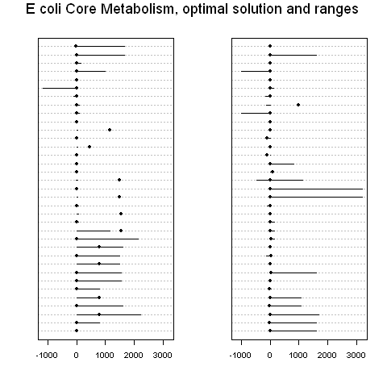

Practical 5 for 2009/2010 - Flux Balance Analysis
=================================================

.. highlight:: r

Flux Balance Analysis (FBA)
---------------------------

The goal of *Flux Balance Analysis* (FBA) is to model the flux
distributions through a metabolic network. The fluxes analysed by
FBA are two types: *metabolite fluxes* and *reaction fluxes*. The
flux of a metabolite is the rate of change of its concentration
over time. In contrast, the flux of a reaction is a measure of the
activity of that reaction, that is, the rate at which the reaction
is changing substrates (reactants) into products over time.

The first step in FBA is to describe the dynamics of the network
under study in the form of *balance equations*. The balance
equations simply state that the change in concentration of a
metabolite over time (the flux of the metabolite) is equal to the
difference between the rates at which the metabolite is produced
and consumed.

In a *steady state*, the fluxes of all the metabolites in the
metabolite reactions are zero, that is, their concentrations are
not changing. One of the aims of FBA is to find the steady state(s)
of the metabolic network. It is of particular interest to predict
the values of all the reaction fluxes (ie. reaction activities) in
the metabolic network when the network is in a steady state (ie.
when the metabolite concentrations are stable).

In a *steady state*, the balance equations are represented by a
*matrix equation*: **S** • **v** = 0, where **S** is the
stoichiometric matrix for the metabolic network under study, and
**v** is a vector of all the reaction fluxes.

In Flux Balance Analysis, optimal steady-state reaction fluxes are
calculated by solving the matrix equation above, using a
mathematical approach called *linear programming*. A solution to
the matrix equation is a particular combination of values for all
of the reaction fluxes, in the situation when the metabolite
network is in a steady state and optimised for growth under certain
conditions (eg. in a glucose-rich environment, so using glucose as
the energy source).

By calculating optimal reaction fluxes under various conditions
(eg. in a glutamate-rich environment, glucose-rich environment,
etc.), it is possible to use FBA to generate quantitative
hypotheses regarding the relative values of different reaction
fluxes under those environmental conditions.

Flux Balance Analysis for *E. coli* in R
----------------------------------------

There R "LIM" library can be used for Flux Balance Analysis. This
library finds the solution of the FBA matrix equation by using
linear programming. To install the LIM library, you can type:

::

    > install.packages("LIM")
    > library("LIM") # Load the LIM library

The LIM library comes with an example data set, which is for FBA of
*Escherichia coli*. This is based on a paper describing a FBA of
*E. coli* by Edwards *et al* (2002) (*Environmental Microbiology*
4:133-140,
`http://www.ncbi.nlm.nih.gov/pubmed/12000313 <http://www.ncbi.nlm.nih.gov/pubmed/12000313>`_).
This data set contains data for 53 metabolites (GLC, G6P, F6P, FDP,
T3P2, T3P1, 13PDG, 3PG, 2PG, PEP, PYR, ACCOA, CIT, ICIT, AKG,
SUCCOA, SUCC, FUM, MAL, OA, ACTP, ETH, AC, LAC, FOR, D6PGL, D6PGC,
RL5P, X5P, R5P, S7P, E4P, RIB, GLX, NAD, NADH, NADP, NADPH, HEXT,
Q, FAD, FADH, AMP, ADP, ATP, GL3P, CO2, PI, PPI, O2, COA, GL, QH2),
and 70 reactions (named by the enzyme that carries them out (GLK1,
PGI1, PFKA, FBP, FBA, TPIA, GAPA, PGK, GPMA, ENO, PPSA, PYKA, ACEE,
ZWF, PGL, GND, RPIA, RPE, TKTA1, TKTA2, TALA, GLTA, ACNA, ICDA,
SUCA, SUCC1, SDHA1, FRDA, FUMA, MDH, DLD1, ADHE2, PFLA, PTA, ACKA,
ACS, PCKA, PPC, MAEB, SFCA, ACEA, ACEB, PPA, GLPK, GPSA1, RBSK,
NUOA, FDOH, GLPD, CYOA, SDHA2, PNT1A, PNT2A, ATPA, GLCUP, GLCPTS,
GLUP, RIBUP, ACUP, LACUP, FORUP, ETHUP, SUCCUP, PYRUP, PIUP, O2TX,
CO2TX, ATPM, ADK, Growth).

The input file for the *E. coli* FBA is available at
`http://www.ucc.ie/microbio/MB6300/E\_coli.lim <http://www.ucc.ie/microbio/MB6300/E_coli.lim>`_.
If you look at this file in your web browser, you will see that it
contains all the reaction equations for the metabolic reactions in
*E. coli*, and the names of the enzyme that carries out each
reaction, for example, for the pentose phosphate pathway:

::

    !Pentose Phosphate Pathway
    ZWF:   G6P + NADP <-> D6PGL + NADPH              !      Glucose 6-phosphate-1-dehydrogenase                         
    PGL:   D6PGL -> D6PGC                            !      6-Phosphogluconolactonase                         
    GND:   D6PGC + NADP -> NADPH + CO2 + RL5P        !      6-Phosphogluconate dehydrogenase (decarboxylating) 
    RPIA:  RL5P <-> R5P                              !      Ribose-5-phosphate isomerase A                    
    RPE:   RL5P <-> X5P                              !      Ribulose phosphate 3-epimerase                     
    TKTA1: R5P + X5P <-> T3P1 + S7P                  !      Transketolase I                                   
    !  TKTB1: R5P + X5P <-> T3P1 + S7P               !      Transketolase II                                  
    TKTA2: X5P + E4P <-> F6P + T3P1                  !      Transketolase I                                   
    !  TKTB2: X5P + E4P <-> F6P + T3P1               !      Transketolase II                               
    TALA:  T3P1 + S7P <-> E4P + F6P                  !      Transaldolase A                             

For example, this tells us that the enzyme ZWF (Glucose
6-phosphate-1-dehydrogenase) carries out the reaction thats
converts G6P (glucose-6-phosphate and NADP, to D6PGL and NADPH.

To read the "E\_coli.lim" file into R, you need to use the Setup()
command from the LIM library:

::

    > LIMEcoli <- Setup("http://www.ucc.ie/microbio/MB6300/E_coli.lim")

This reads in the *E. coli* data set required for the FBA, and
creates the balance equations for the metabolites (53 balance
equations for the 53 metabolites), and the matrix equation that FBA
must solve.

The variable *LIMEcoli* that is created by the Setup() command
contains all the information on *E. coli* required for the FBA. As
mentioned in previous practicals (see MB6301 Practical 1,
`http://www.ucc.ie/microbio/MB6301/practical1\_words\_v2.html <http://www.ucc.ie/microbio/MB6301/practical1_words_v2.html>`_),
an R variable can have named elements, and you can find out the
names of those named elements by using the attributes() command,
which will return a list of the named elements under the heading
"$names":

::

    > attributes(LIMEcoli)
    $names
     [1] "file"         "NUnknowns"    "NEquations"   "NConstraints" "NComponents" 
     [6] "NExternal"    "NVariables"   "A"            "B"            "G"           
    [11] "H"            "Cost"         "Profit"       "Flowmatrix"   "VarA"        
    [16] "VarB"         "Parameters"   "Components"   "Externals"    "rates"       
    [21] "markers"      "Variables"    "costnames"    "profitnames"  "eqnames"     
    [26] "ineqnames"    "Unknowns"     "ispos"       

To get the values of any of the named elements of an R variable,
you can type the R variable's name, followed by "$", followed by
the name of the named element. For example, to get the value of the
named element "Unknowns", which contains the 70 reaction fluxes, we
type:

::

    > LIMEcoli$Unknowns 
     [1] GLK1   PGI1   PFKA   FBP    FBA    TPIA   GAPA   PGK    GPMA   ENO    PPSA   PYKA  
    [13] ACEE   ZWF    PGL    GND    RPIA   RPE    TKTA1  TKTA2  TALA   GLTA   ACNA   ICDA  
    [25] SUCA   SUCC1  SDHA1  FRDA   FUMA   MDH    DLD1   ADHE2  PFLA   PTA    ACKA   ACS   
    [37] PCKA   PPC    MAEB   SFCA   ACEA   ACEB   PPA    GLPK   GPSA1  RBSK   NUOA   FDOH  
    [49] GLPD   CYOA   SDHA2  PNT1A  PNT2A  ATPA   GLCUP  GLCPTS GLUP   RIBUP  ACUP   LACUP 
    [61] FORUP  ETHUP  SUCCUP PYRUP  PIUP   O2TX   CO2TX  ATPM   ADK    Growth  

There are no values for the 70 reaction fluxes, as before running
FBA, the values of the reaction fluxes have not yet been set. A
major aim of FBA is to predict the values of these reaction fluxes
under a steady-state when the metabolic network is optimised for
the particular environmental conditions.

Once the input file has been read in, you can then calculate the
solution of the FBA, that is, you can predict the optimal values of
these reaction fluxes in a steady-state, that is the values of the
reaction fluxes that will give optimal growth under the particular
environmental conditions. In this *E. coli* example, a particular
set of concentrations of different sugars and other nutrients in
the environment has been defined by the E\_coli.lim file.

The optimal values of the fluxes are calculated using linear
programming, using the Linp command from the "LIM" library:

::

    > LP <- Linp(LIMEcoli)
    > LP # Print out the solution
            GLK1       PGI1       PFKA FBP        FBA       TPIA       GAPA        PGK       GPMA        ENO PPSA      PYKA         ACEE ZWF PGL GND
    [1,] 0.00000 807.532745 781.590686   0 781.590686 781.590686 1541.43420 1541.43420 1492.08909 1492.08909    0 466.65796 1158.9491902   0   0   0
    [2,] 5.66169   5.639786   5.553995   0   5.553995   5.553995   11.03607   11.03607   10.87288   10.87288    0  10.50489    0.1949477   0   0   0
    ...

You will see when you print out the solution (by typing the name of
the variable *LP* here) that it includes predicted reaction flux
values for each of the 70 reactions in the metabolic network under
study. In fact, two flux values are predicted for each reaction:
the first value (eg. 781.590686 for the reaction catalysed by
enzyme PFKA) is the optimal flux value for maximum growth of the
*E. coli* cell, while the second flux value (eg. 5.553995 for the
reaction catalysed by enzyme PFKA) is the optimal flux value under
a different optimisation criterion. What is of most interest is the
optimal flux value for maximum growth.

It is also possible to calculate the minimum and maximum possible
value for each reaction flux, under steady-state conditions, using
the Xranges() function:

::

    > xr <- Xranges(LIMEcoli)
                     min         max
    GLK1       0.0000000   10.000000
    PGI1     -15.8333333  807.532745
    PFKA       0.8333333 2229.130000
    FBP        0.0000000 1604.130000
    FBA        0.8333333  781.590686
    TPIA       0.8333333  781.590686
    ...

This tells us, for example, that the reaction flux for the reaction
catalysed by enzyme GLK1 must have a flux value in the range from
0-10.

You can plot the minimum, maximum and optimal flux values for each
of the reactions by using the plotFluxes() function in the file
"Rfunctions.R" (available from
`http://www.ucc.ie/microbio/MB6300/Rfunctions.R <http://www.ucc.ie/microbio/MB6300/Rfunctions.R>`_):

::

    > source("http://www.ucc.ie/microbio/MB6300/Rfunctions.R") # Read in Rfunctions.R
    > plotFluxes(LIMEcoli)

The resulting picture shows the optimal reaction fluxes for each of
the 70 reactions as dots (stacked one under the other, for the 70
reactions), and range of possible fluxes (from minimum to maximum)
for each reaction as a horizontal line on either side of that dot:

|image0|

Summary
-------

In this practical, you will have learnt to use the following
functions:

#. Setup() from the LIM library for reading in an input file for
   FBA
#. Linp() from the LIM library for finding the optimal reaction
   flux solutions of FBA
#. Xranges() from the LIM library for finding the range of possible
   reaction fluxes in FBA
#. plotFluxes() from the LIM library for making a plot of the
   optimal reaction fluxes, and ranges of reaction fluxes in FBA

Links and Further Reading
-------------------------

Some links are included here for further reading, which will be
especially useful if you need to use R or analyse a gene regulatory
network for your project or assignments.

For background reading on Flux Balance Analysis, it is recommended
to read Chapter 6 of
*Principles of Computational Cell Biology: from protein complexes to cellular networks*
by Volkhard Helms (Wiley-VCH;
`http://www.wiley-vch.de/publish/en/books/bySubjectLS00/ISBN3-527-31555-1 <http://www.wiley-vch.de/publish/en/books/bySubjectLS00/ISBN3-527-31555-1>`_).

For a more in-depth introduction to R, a good online tutorial is
available on the "Kickstarting R" website,
`cran.r-project.org/doc/contrib/Lemon-kickstart <http://cran.r-project.org/doc/contrib/Lemon-kickstart/>`_.

There is also a useful introduction to R in Appendix A ("A Brief
Introduction to R") of the book
*Computational genome analysis: an introduction* by Deonier, Tavaré
and Waterman (Springer).

There is another nice (slightly more in-depth) tutorial to R
available on the "Introduction to R" website,
`cran.r-project.org/doc/manuals/R-intro.html <http://cran.r-project.org/doc/manuals/R-intro.html>`_.

For more information and examples using the "LIM" library, see the
LIM documentation at
`http://cran.r-project.org/web/packages/LIM/index.html <http://cran.r-project.org/web/packages/LIM/index.html>`_.

Acknowledgements
----------------

Many of the ideas for the examples and exercies for this practical
were inspired by the book
*Principles of Computational Cell Biology: from protein complexes to cellular networks*
by Volkhard Helms (Wiley-VCH;
`http://www.wiley-vch.de/publish/en/books/bySubjectLS00/ISBN3-527-31555-1 <http://www.wiley-vch.de/publish/en/books/bySubjectLS00/ISBN3-527-31555-1>`_).

Exercises
---------

Answer the following questions, using the R package. For each
question, please record your answer, and what you typed into R to
get this answer.

Q1. What is the reaction catalysed by the enzyme DLD1 in *E. coli*? 
    What are the metabolites consumed, and the metabolites produced by
    this reaction?
    Are each of these metabolites consumed by any other reactions? If
    so, which?
    Are each of these metabolites produced by any other reactions? If
    so, which?
Q2. What is the optimal reaction flux for the reaction catalysed by DLD1, under steady-state conditions when growth of *E. coli* is optimal, under the set of environmental conditions described in the E\_coli.lim input file? 
    What is the possible range of reaction fluxes for this reaction,
    under steady-state conditions and under the set of environmental
    conditions described in the E\_coli.lim input file?
Q3. For each of the metabolites that are used/produced by the reaction catalysed by enzyme DLD1, look at the optimal fluxes for all of the reactions that consume it. Are the fluxes of all those reactions equal, or is there one reaction that dominates? 
    Now, for each of those metabolites, look at the optimal fluxes of
    all the reactions that produce it. Is there a one dominant reaction
    producing it, or are all the reactions producing it equally active
    (ie. do they have roughly equal fluxes)?
    Do you see any relationship between the number of reactions that a
    particular metabolite is used in (or produced by), and the
    likelihood of one particular reaction dominating its consumption
    (or production)?
Q4. Plot a histogram of the optimal reaction fluxes for all 70 reactions studied in the *E. coli* metabolic network. What do you notice about the shape of the histogram? 
    Are there some reactions that have particularly high fluxes ("hot
    reactions")?
    How many times bigger is the flux of the highest-flux reaction,
    compared to the flux of the lowest-flux reaction?
    Do you think that this result is representing of the whole
    *E. coli* metabolic network, given that only 70 reactions have been
    modelled here (for comparison, EcoCyc currently contains 1388
    *E. coli* reactions)?
    Hint: variable *LP$X[1,]* will contain a table of optimal reaction
    fluxes. This is because the variable *LP* has a named element "X"
    and *LP$x* consists of a matrix containing the predicted fluxes
    (two flux values calculated per reaction); *$X[1,]* is the first
    row of that matrix, which contains the predicted fluxes under
    optimal growth conditions.
Q5. The input file for the *E. coli* FBA example, "E\_coli.lim" describes the particular set of nutrients in the *E. coli* environment, in the FBA model being used. What are the carbon nutrients present? 
    Hint: look under the heading "EXTERNALS" in the file. Abbreviations
    are used for the names of the compounds, but the key for the
    abbreviations is given above that in the file (under heading
    "COMPONENTS").

