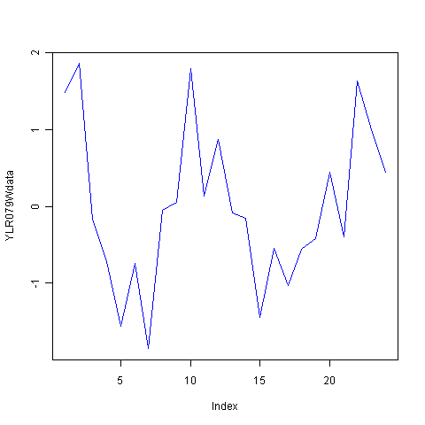
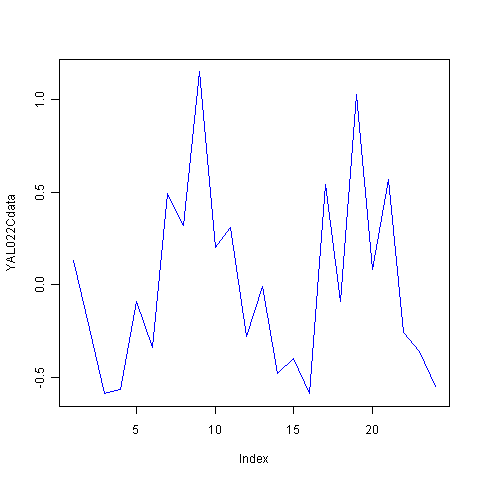
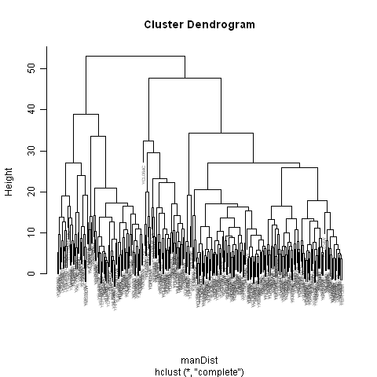
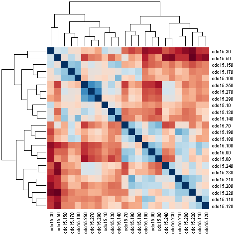
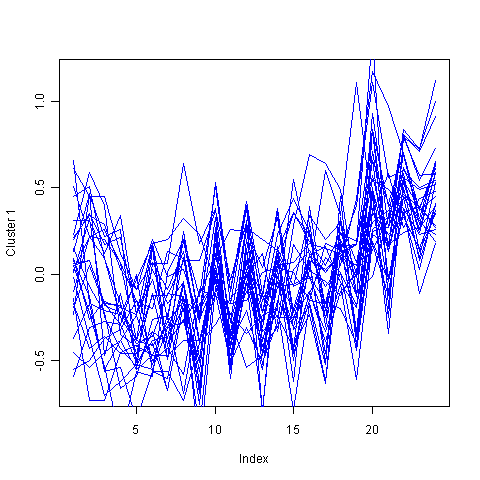

Practical 6 for 2009/2010 - Microarray Analysis
===============================================

.. highlight:: r

Contents
--------

Microarrays
-----------

*Microarrays* are an experimental tool used to measure the
expression level (mRNA transcript concentration) of every gene in a
cell. There are several different types of microarray for this
purpose.

All microarrays depend on the principle that a mRNA from a
particular gene will hybridise (bind to) a single-stranded DNA or
RNA sequence that is complementary to it. Thus, a microarray is
essentially a tiny chip (like a computer microchip in size and
appearance) that contains many pieces of single-stranded DNA or RNA
anchored to the chip, each piece of which is complementary to the
mRNA sequences from one or more genes of the species that the
microarray is designed for.

To measure mRNA concentrations from a particular sample (eg. yeast
cells), you extract mRNAs from the sample, and wash them over the
chip, and the mRNAs hybridise (bind) to the short complementary
DNA/RNA sequences that are anchored to the chip. If you can figure
out which of the sequences anchored to the chip now have mRNAs
bound to them, you can figure out how much of the mRNA from each
gene was in your original sample.

One type of microarray is a "two-colour microarray". In a
two-colour microarray experiment, the biologist extracts mRNAs from
two different samples, for example, diseased tissue versus healthy
tissue. The two samples are labelled with two different fluorescent
dyes, and then are mixed and used for a single microarray
experiment. The two dyes fluoresce (produce light) of different
wavelengths (usually green and red), and so it is possible to
estimate the amount of mRNA from a particular gene that was in the
diseased versus healthy tissue by detecting the light. That is,
what the biologist measures for a particular gene is the ratio
between the amount of mRNA from a gene in the diseased tissue, and
the amount of mRNA from the gene from the healthy tissue. For the
data from a particular microarray, it is common that the ratios can
vary a lot between genes, and therefore it is common to find the
log\ :sub:`2`\  of the ratios, as the log\ :sub:`2`\ (ratios) vary
less between genes.

*Microarray analysis* involves analysing this gene expression data.
One common type of microarray analysis is to *cluster* genes into
groups on the basis of the similarity of their expression
profiles.

Using Microarrays to Study the Yeast Cell Cycle
-----------------------------------------------

One good example of using microarrays to measure and analyse gene
expression is the study of changes in gene expression during the
yeast cell cycle. For example, Spellman *et al*
(1998*Mol. Biol. Cell* *12*:3273-97,
`http://www.ncbi.nlm.nih.gov/pmc/articles/PMC25624/?tool=pubmed <http://www.ncbi.nlm.nih.gov/pmc/articles/PMC25624/?tool=pubmed>`_)
used microarrays to study changes in the expression (mRNA levels)
of genes during the cell cycle of the yeast
*Saccharomyces cerevisiae*. They examined the expressions of the
entire yeast genome through two rounds of the cell cycle. The
temporal expression of about 6000 genes (almost all yeast genes)
were measured by microarrays at 24 time points every five hours.
This meant that Spellman *et al* actually generated 24 microarray
data sets, one for each time point.

Spellman *et al* did this by studying mRNA levels in a particular
yeast mutant that had a temperature-sensitive mutation (a mutation
that only exhibits a phenotype in a certain range of temperatures)
in a cell cycle gene called *cdc15*. The mutation in the *cdc15*
gene causes the yeast cells to stop at a particular point in the
cell cycle, but only if the yeast is at a particular temperature
(37°C). This allowed Spellman *et al* to make all the yeast cells
in their culture stop at that particular point in cell cycle (by
growing them at 37°C), and then to move them to a temperature at
which the mutation caused no phenotype (23°C) and let them all
resume the cell cycle together. That is, by studying the cell cycle
in this *cdc15* temperature-sensitive mutant, Spellman *et al* were
able to ensure that the culture of yeast cells that they were
studying were all synchronised as they went through the cell
cycle.

Spellman *et al* used two-colour microarrays for their experiments.
That is, for each microarray experiment for a particular
time-point, they labelled mRNAs from the synchronised *cdc15*
mutant with a particular fluorescent dye, and labelled mRNAs from a
control sample of unsynchronised yeast cell with a second
fluorescend dye. Thus, for each microarray experiment, for each
particular yeast gene they could calculate a ratio of the amount of
mRNA produced in the synchronised *cdc15* mutant yeast cells at
that time, and the amount of mRNA produced in the unsynchronised
control yeast cells at that time.

Note that when talking about techniques for analysing microarray
data, it is common to refer to the genes as *features* and the data
from a particular microarray experiment as a *sample* or
*experiment*. Thus, the data set of Spearman *et al* is said to
include data from 24 different samples (24 microarray experiments,
corresponding to 24 time-points during the yeast cell cycle).

Online Databases of Microarray Data
-----------------------------------

Many published microarray expression data sets are publicly
available in microarray expression databases. One well known
microarray data database is the Stanford Microarray Database,
`http://smd.stanford.edu/ <http://smd.stanford.edu/>`_. Another
well known microarray data database is the Array Express database,
`http://www.ebi.ac.uk/microarray-as/ae/ <http://www.ebi.ac.uk/microarray-as/ae/>`_.

It is possible to search for published data sets on the Stanford
Microarray Database and Array Express database websites. For
example, to search for Spellman *et al*'s data set for the *cdc15*
mutant in the Array Express database, you would follow these
steps:

#. Go to the Array Express database website,
   `http://www.ebi.ac.uk/microarray-as/ae/ <http://www.ebi.ac.uk/microarray-as/ae/>`_
#. You will see a search box under the heading "Experiments
   Archive". Type "Spellman PT" in this box to search for experiments
   published by the group of Paul T Spellman, and press "Return".
#. On the search page, you will see a list of experiments published
   by Paul T Spellman and co-workers. One of these should have the
   title "Transcription profiling of yeast cdc15 block-release". This
   is the cell cycle data for the *cdc15* mutant.
#. To the right of the title "Transcription profiling of yeast
   cdc15 block-release", you will see the Array Express identifier for
   this data set, which is "E-SMDB-1886" in this case.
#. The line containing the title "Transcription profiling of yeast
   cdc15 block-release" will start with a small "+" symbol. Click on
   this symbol to find out more information about this data set. This
   will display information about the data set such as the original
   paper that desecribed it, the organism name, what data files are
   available, etc.

Microarray Data Analysis in R: Spellman *et al*'s Yeast Cell Cycle Data
-----------------------------------------------------------------------

Spellman *et al*'s yeast cell cycle microarray data is available in
R as a data set that comes with the "yeastCC" R library.

The "yeastCC" R library is one of the Bioconductor set of R
libraries. Therefore, it has to be installed using a slightly
different procedure than other R libraries. If you have a direct
connection to the internet, you install it by typing in R:

::

    > source("http://bioconductor.org/biocLite.R")
    > biocLite("yeastCC")

Once you have installed the "yeastCC" library, you can load
Spellman *et al*'s yeast cell cycle data set into R by typing:

::

    > library("yeastCC") # Load the yeastCC library 
    > data("yeastCC")    # Load Spellman et al's yeast cell cycle microarray data   
    > yeastCC            # Print out information about variable "yeastCC"
    ExpressionSet (storageMode: environment)
    assayData: 6178 features, 77 samples 
    ...

This loads Spellman *et al*'s yeast cell cycle microarray data set
into the variable *yeastCC*. By typing the name of the variable
*yeastCC*, we can get some information about this data (see above).
We see that the variable contains gene expression data for 6178
yeast genes. The gene expression data consists of log-ratios, that
is, where the log\ :sub:`2`\ (ratio) for a particular gene in a
particular experiment is the log of the ratio between the mRNA
level measured in the experiment for that gene (eg. in the *cdc15*
mutant at a particular time-point) and the mRNA level measured in
the control for that gene (eg. in the unsynchronised yeast cells at
that time-point).

Note that the variable *yeastCC* contains the data for the 24
*cdc15* microarray experiments (ie. 24 microarrays at 24
time-points), but also contains data for some other microarray
experiments carried out by Spellman *et al* that were published in
the same paper. In fact, the *yeastCC* variable contains data from
77 microarray experiments, only 24 of which are the *cdc15* mutant
data. You can get the names of all the experiments by using the
pData() function in the Biobase library. The "Biobase" R library is
one of the Bioconductor set of R libraries. Therefore, it has to be
installed using a slightly different procedure than other R
libraries. If you have a direct connection to the internet, you
install it by typing in R:

::

    > source("http://bioconductor.org/biocLite.R")
    > biocLite("Biobase")

The pData() function in the Biobase library prints out the
information available for each microarray experiment:

::

    > library("Biobase")
    > pData(yeastCC)
              Timecourse Timepoint Phase
    cln3.1           cln    cln3.1  <NA>
    cln3.2           cln    cln3.2  <NA>
    clb2.2           clb    clb2.2  <NA>
    clb2.1           clb    clb2.1  <NA>
    alpha0         alpha    alpha0  M/G1
    alpha7         alpha    alpha7  M/G1
    ...
    cdc15.10       cdc15  cdc15.10  M/G1
    cdc15.30       cdc15  cdc15.30  M/G1
    cdc15.50       cdc15  cdc15.50    G1
    cdc15.70       cdc15  cdc15.70    G1
    cdc15.80       cdc15  cdc15.80     S
    cdc15.90       cdc15  cdc15.90    G2
    cdc15.100      cdc15 cdc15.100     M
    cdc15.110      cdc15 cdc15.110     M
    cdc15.120      cdc15 cdc15.120  M/G1
    cdc15.130      cdc15 cdc15.130  M/G1
    cdc15.140      cdc15 cdc15.140    G1
    cdc15.150      cdc15 cdc15.150    G1
    cdc15.160      cdc15 cdc15.160    G1
    cdc15.170      cdc15 cdc15.170     S
    cdc15.180      cdc15 cdc15.180     S
    cdc15.190      cdc15 cdc15.190    G2
    cdc15.200      cdc15 cdc15.200    G2
    cdc15.210      cdc15 cdc15.210     M
    cdc15.220      cdc15 cdc15.220     M
    cdc15.230      cdc15 cdc15.230     M
    cdc15.240      cdc15 cdc15.240  M/G1
    cdc15.250      cdc15 cdc15.250  M/G1
    cdc15.270      cdc15 cdc15.270    G1
    cdc15.290      cdc15 cdc15.290    G1
    ...

Only the 23rd to 4666666th experiments are for the *cdc15* mutant.
The information for these experiments tells us the time during the
cell cycle (M phase, G1 phase, G2 phase or S phase) that each of
the 24 microarrays on the *cdc15* mutants was made, and also how
many minutes from the start of the experiment that time
corresponded to (the 24 microarray experiments were made after 10,
30, 50, 70, 80, 90, 100, 110, 120, 130, 140, 150, 160, 170, 180,
190, 200, 210, 220, 230, 240, 250, 270, and 290 minutes,
respectively, after shifting the *cdc15* mutant yeast cell cycles
to 23°C). We can see from this that the *cdc15* mutant yeast cells
were at the M/G1 boundary at the first time-point, and then went
through two whole cell cycles (M->G1->G2->S) during the period
until the last (24th) time-point (at G1). The last stage of the
cell cycle is M (mitosis) phase, when the cell divides, so Spellman
*et al* followed the synchronised *cdc15* mutant yeast cells
through two cell cycles from start to finish.

As mentioned above, the gene expression measurements at each
time-point for each gene are log\ :sub:`2`\ (ratios), that is log
to the base 2 of the ratio between the measurement for the mRNA
expression in the *cdc25* mutant at that time-point and the
measurement for the mRNA expression in the control yeast cells
(unsynchronised yeast cells) at that time-point. To find out what
are the names of the genes that we have data for, we can use the
featureNames() function in the "Biobase" R library. For example, to
print out the number of yeast genes for which we have data, and the
names of the first 10 yeast genes for which we have data, we can
type:

::

    > genenames <- featureNames(yeastCC)
    > length(genenames) # Find the number of yeast genes for which we have data
    [1] 6178
    > genenames[1:10]   # Print out the names of the first 10 yeast genes for which we have data
     [1] "YAL001C" "YAL002W" "YAL003W" "YAL004W" "YAL005C" "YAL007C" "YAL008W" "YAL009W" "YAL010C" "YAL011W"

Here the identifiers from the SGD (*Saccharomyces* Genome Database,
`http://www.yeastgenome.org/ <http://www.yeastgenome.org/>`_) are
used as the names of the genes here.

As mentioned above, the *yeastCC* variable contains data from other
microarray experiments in addition to the *cdc15* mutant
experiments. To extract out the data from just the 24 *cdc15*
mutant experiments (the 23rd to 46th experiments), we can type:

::

    > yeastcdc15 <- yeastCC[1:6178, 23:46] 
    > yeastcdc15 # Print out information for the "yeastcdc15" variable
    ExpressionSet (storageMode: environment)
    assayData: 6178 features, 24 samples 
    ...

We now have extracted out the information for just the 24
microarray experiments performed on the *cdc15* mutant yeast cells,
at 24 time-points during the cell cycle.

The variable *yeastcdc15* contains information on the names of the
genes and the times during the cell cycle when the microarray data
was collected, as well as the microarray mRNA expression data
itself. The microarray expression data itself can be viewed by
using the exprs() function from the "Biobase" R library. For
example, to see the mRNA expression data (log\ :sub:`2`\ (ratios))
for the first yeast 10 genes, we type:

::

    > expndata <- exprs(yeastcdc15)
    > dim(expndata) # Print out the dimensions of variable "expndata" 
    [1] 6178   24
    > expndata[1:10, 1:24]
            cdc15.10 cdc15.30 cdc15.50 cdc15.70 cdc15.80 cdc15.90 cdc15.100 cdc15.110 cdc15.120 cdc15.130
    YAL001C    -0.16     0.09    -0.23     0.03    -0.04    -0.12     -0.28     -0.44     -0.09      0.12
    YAL002W       NA       NA       NA    -0.58     0.23    -0.23      0.08     -0.62      0.55     -0.32
    YAL003W    -0.37    -0.22    -0.16     0.04     0.53    -0.25      0.08     -0.24      0.37     -0.22
    YAL004W       NA       NA       NA    -1.50    -0.03    -1.20     -0.06     -1.78      0.14     -1.13
    YAL005C    -0.43    -1.33    -1.53    -1.53    -0.37    -1.65     -0.71     -1.53     -0.10     -1.15
    YAL007C       NA       NA       NA     0.14     0.58     0.25      0.03     -1.00      0.00     -0.41
    YAL008W    -0.20     0.04    -0.27    -0.40     0.44    -0.73      0.03     -0.69      0.55     -0.53
    YAL009W       NA    -0.02     0.00     0.07     0.14     0.17      0.23      0.19     -0.10      0.00
    YAL010C    -0.24    -0.06    -0.11    -0.25     0.40    -0.52      0.19     -0.31      0.63     -0.31
    YAL011W       NA       NA       NA    -0.29    -0.09     0.02      0.29     -0.52      0.02     -0.15
            cdc15.140 cdc15.150 cdc15.160 cdc15.170 cdc15.180 cdc15.190 cdc15.200 cdc15.210 cdc15.220 cdc15.230
    YAL001C      0.06     -0.04      0.31      0.59      0.34     -0.28     -0.09     -0.44      0.31      0.03
    YAL002W      0.03     -0.56      0.47     -0.15      0.49        NA      0.23     -0.49      0.33      0.18
    YAL003W      0.16     -0.21      0.03      0.03      0.48        NA      0.22     -0.06      0.08      0.56
    YAL004W     -0.13     -1.27     -0.27     -0.94      0.14        NA      1.04      0.48      1.94      1.62
    YAL005C     -0.33     -1.15     -0.19     -0.84      0.52        NA      1.18      0.88      1.80      2.24
    YAL007C      0.10      0.14      0.40      0.20      0.24        NA      0.26     -0.39      0.43     -0.26
    YAL008W      0.10     -0.20      0.29     -0.15      0.60        NA      0.07     -0.31      0.30      0.50
    YAL009W     -0.21      0.01     -0.13     -1.38      0.16      0.05      0.29      0.04      0.39     -0.21
    YAL010C      0.15     -0.27      0.50     -0.14      0.46        NA      0.13     -0.56      0.19      0.71
    YAL011W      0.06     -0.17      0.51     -0.20      0.25        NA     -0.14     -0.22      0.23      0.23
            cdc15.240 cdc15.250 cdc15.270 cdc15.290
    YAL001C      0.57      0.00      0.02     -0.26
    YAL002W      0.65     -0.29        NA        NA
    YAL003W      0.48     -0.47     -0.45     -0.41
    YAL004W      1.73      1.22        NA        NA
    YAL005C      2.34      1.43      1.27      1.18
    YAL007C     -0.33     -0.37        NA        NA
    YAL008W      0.82     -0.08     -0.13     -0.04
    YAL009W      0.29      0.00      0.00      0.03
    YAL010C      0.73     -0.40     -0.40     -0.52
    YAL011W      0.36     -0.19        NA        NA

In the commands above, the dim() function was used to find the
dimensions of the *expndata* variable, and we can see from the
result that it is a matrix with 6178 rows and 24 columns. We can
then print out the information for the first 10 rows of the matrix,
which gives us the mRNA expression estimates
(log\ :sub:`2`\ (ratios)) for the first 10 yeast genes. For each
yeast gene, there are 24 different mRNA expression estimates
(log\ :sub:`2`\ (ratios)), one for each of the 24 time-points in
the yeast cell cycle when a microarray was used to measure gene
expression levels. You can see some 'NA's in the results for the
first 10 yeast genes, which correspond to missing data.

We can plot the mRNA expression estimates (log\ :sub:`2`\ (ratios))
for a particular yeast gene, at the 24 time-points during the cell
cycle, by extracting out the data from that gene from the
*expndata* variable. For example, to plot the data for gene
*YLR079W*, which is a gene involved in cell cycle progression and
is also known as *SIC1*, we type:

::

    > YLR079Wdata <- expndata["YLR079W",]
    > plot(YLR079Wdata, type="l", col="blue") # Draw a plot, with a line between each data point in the plot

We see from the plot for *YLR079W* that its mRNA expression varies
throughout the 24 time-points. In fact, it starts off high at the
first time-point (the M/G1 boundary, which is at the start of a new
cell cycle, as explained above), then gets very low and then
reaches a peak again after about 12 hours. This is presumably the
first cell cycle that the synchronised *cdc15* mutant yeast cells
went through. The *YLR079W* shows the same high-low-high change in
expression through the second 12 hours (the second cell cycle).
This agrees well with what is known about the SIC1 protein, namely,
that it is a protein required for end of the cell cycle (the M or
mitosis phase); thus, it makes sense that we see that its mRNA
expression peaks at the M/G1 boundary during each round of the cell
cycle.

|image0|

Microarray Data Analysis in R: Finding Genes with Periodic Expression Patterns
------------------------------------------------------------------------------

In order to identify genes that vary in mRNA expression during the
yeast cell cycle, Spellman *et al* compared the mRNA levels from
each gene over time with sine and cosine functions ofa period
similar to the length of the yeast cell cycle. That is, they looked
for genes that go up and down in mRNA levels in a regular pattern
during the yeast cell cycle.

There are many R libraries for analysing preprocessed microarray
data. The "GeneCycle" R library can be used to find genes that go
up and down in mRNA levels in a regular pattern in microarray data
for which you have a *time series* (that is, where you have a
series of microarrays that were performed on samples collected over
time, as in the case of Spellman *et al*'s data set).

For example, you can use the findPeriodicGenes() function in file
"Rfunctions.R" (available from
`www.ucc.ie/microbio/MB6300/Rfunctions.R <http://www.ucc.ie/microbio/MB6300/Rfunctions.R>`_).
The findPeriodicGenes() uses several functions from the "GeneCycle"
library to identify periodically expressed genes. For example, to
identify periodically expressed genes in Spellman *et al*'s yeast
cell cycle data set, you would type:

::

    > install.packages("GeneCycle")          # Install the GeneCycle library
    > source("Rfunctions.R")               
    > mygenes <- findPeriodicGenes(expndata) # Find periodically expressed genes

The function findPeriodicGenes() returns a list variable with two
elements, the first of which is a vector containing the names of
the periodically expressed genes, and the second of which is a
vector containing the statistical significance for each of these
genes (ie. a *P*-value that tells you how statistically significant
is the periodicity of expression for a gene). For example, we can
find the number of periodic genes, and get the names and *P-*values
for the first ten periodic genes by typing:

::

    > genenames <- mygenes[[1]]
    > pvalues   <- mygenes[[2]]
    > length(genenames) # Find the number of periodic genes
    [1] 279
    > genenames[1:10]
     [1] "YAL022C" "YAL038W" "YAR007C" "YBL003C" "YBL009W" "YBL066C" "YBL075C"
     [8] "YBR008C" "YBR038W" "YBR054W"
    > pvalues[1:10]
     [1] 0.033187647 0.038506444 0.002029094 0.028566874 0.043717785 0.021192974
     [7] 0.036522808 0.004739764 0.001481442 0.001107805

This tells us that there were 279 genes with periodic expression
identified. The first of these is *YAL022C*, which has a
statistical significance of *P*=0.033. We can plot the expression
of *YAL022C* over time during the cell cycle by typing (as above):

::

    > YAL022Cdata <- expndata["YAL022C",]
    > plot(YAL022Cdata, type="l", col="blue") # Draw a plot, with a line between each data point in the plot

It is obvious from the plot (below) that the expression of
*YAL022C* is indeed periodic during the cell cycle.

|image1|

Microarray Data Analysis in R: Hierarchical Clustering and Heatmaps
-------------------------------------------------------------------

One common type of microarray analysis is clustering.

*Clustering* is an extremely popular analytical approach for
identifying and visualizing patterns of gene expression in
microarray datasets. All clustering methods aim at grouping
objects, such as genes (or samples), together, according to some
measure of similarity, so that objects within one group or cluster
are more similar to each other than to objects in other groups.
Clustering analysis involves one essential elementary concept: the
definition of similarity between objects, also known as distance
measure.

In order to identify genes that vary in a similar way within the
cell cycle, we can cluster genes with the
*hierarchical clustering algorithm*. Hierarchical clustering is the
simplest approach to clustering. It starts with a distance matrix,
which contains the distances between all the objects (eg. genes),
and iteratively finds the closest pair of objects and merges them
together into a cluster, and then computes the distance between the
new cluster and all the other objects/clusters. Then it finds the
next closest pair of objects and merges them, and so on. This is
very similar to the neighbour-joining algorithm for building a
phylogenetic tree.

You can carry out hierarchical clustering in R using the hclust()
function. In order to use the hclust() function to cluster genes,
you first need to calculate distances between each pair of genes,
that reflect what is the difference between their expression
patterns. That is, two genes that have similar gene expression
patterns (mRNA levels) at each of the 24 time-points during the
cell cycle should have a small distance. Genes that have very
different expression patterns (mRNA levels) at each of the 24
time-points during the cell cycle should have a large distance. One
popular measure of distance between two genes is the
*Manhattan distance*, is the sum of the absolute distances between
the genes in each of the samples (in each of the 24 time-points
here).

For example, to cluster the genes from the Spellman *et al* data
set into clusters, we may first decide to just cluster the 279
genes that we already have identified as having periodic expression
over the cell cycle (see above). We first have to retrieve the rows
from the matrix *expndata* that just correspond to these 279
genes:

::

    > expndata2 <- expndata[genenames,]     # Retrieve the expression data for just the 279 periodically expressed genes
    > dim(expndata2)                        # Print out the number of rows and columns in matrix "expndata2"
    [1]  279 24

The matrix variable *expndata2* contains information for the 24
samples (24 microarrays) for the 279 periodically expressed genes.

The next step in clustering is to calculate a distance between each
pair of your set of objects, that is, each pair of genes in this
case. To do this, one commonly used distance measure is the
"Manhattan" distance. You can calculate the Manhattan distance
using the dist() function in R:

::

    > manDist <- dist(expndata2, method="manhattan")   # Calculate the "Manhattan" distance between each pair of genes

The variable *manDist* contains an estimate of the distance between
each pair of the periodically expressed genes, where the distance
between a pair of genes is a measure of how different are the
expression patterns of those genes. Once we have calculated
distances between all pairs of genes, we can then use the hclust()
function to cluster the genes into groups using hierarchical
clustering:

::

    > hclusters <- hclust(manDist) # Find clusters using hierarchical clustering 

You can then plot the clusters by using the plot() function:

::

    > plot(hclusters, cex=0.5)     # Plot the clusters

You can see in the plot of the clusters (below) that the 279 genes
with periodic expression are grouped together into clusters, where
genes that are more similar in expression pattern are closer
together in the tree of clusters. Note that the "cex=0.5" option
was used for the plot() function above, to adjust the size of the
text for the gene labels, because otherwise the labels for the gene
names are very large. Unfortunately, when the gene name labels are
plotted at this size, they are too small to read.

|image2|

Another popular way of visualising hierarchical clustering results
is to draw a *heatmap*. In a heatmap, the genes are shown clustered
together in the clusters found by hierarchical clustering, but in
addition the distances between the pairs of genes are displayed in
different colours. You can draw a heatmap by using the
plotHeatmap() function in file "Rfunctions.R":

::

    > plotHeatmap(manDist)

In the heatmap picture (below), the hierarchical clusters of the
genes are shown along the top of the matrix, and along the left
side. On the right side and on the bottom, the names of the genes
are given, but are unfortunately too small to read. The colours in
the matrix show the Manhattan distance between a pair of genes (the
gene for that particular row and column), where large distances are
plotted in red and small distances in blue.

|image3|

As well as clustering the genes together, we can also perform
hierarchical clustering on the 24 samples (24 microarrays) to
cluster the samples together into those that show the most similar
expression in all genes. To do this, we must first make a new
matrix that has one row per sample (rather than one row per gene).
We can do this by finding the *transpose* of the matrix *expndata2*
(ie. swapping columns for rows) using the R t() function:

::

    > expndata3 <- t(expndata2)
    > dim(expndata3) 
    [1] 24 279
    > manDist2 <- dist(expndata3, method="manhattan")
    > plotHeatmap(manDist2)

In the heatmap that we draw based on these hierarchical clustering
results, we see that, in general, samples based on adjacent
time-points during the cell cycle (eg. the samples for 30 minutes
and 50 minutes) are clustered together (are close together in the
tree of clusters) and have small Manhattan distances (so the
distances between them are plotted in blue).

|image4|

Microarray Data Analysis in R: K-Means Clustering
-------------------------------------------------

Another commonly used method for clustering objects (genes or
microarray samples) is *K-means clustering algorithm*. K-means
clustering finds *k* clusters in the data set, where the user has
to specify beforehand what is the number (*k* of desired clusters.
K-means clustering starts by randomly choosing *k* objects (eg.
genes) to be the *centres* of the *k* clusters. The algorithm then
places all other objects into the cluster defined by the *centre*
that is closest to it (using some distance measure to calculate
distances, such as the Manhattan distance measure). The next step
in the algorithm is to replace the *centres* of the *k* clusters by
the mean values of the initial *k* clusters, and then to again
place all objects into the cluster defined by the closest *centre*.
This is repeated again and again until the algorithm converges (ie.
the clusters defined are stable from one iteration to the next).

The kmeans() function in R can be used for K-means clustering.

As described above, the variable *manDist* contains an estimate of
the distance between each pair of the periodically expressed genes.
We can then use the kmeans() function, using variable *manDist* as
its input, to cluster the genes into groups using K-means
clustering. We have to decide on the number of clusters we want to
find. Say, for example, we decide that we want to find 16 clusters
(chosen arbitrarily), then we'd type:

::

    > clusters <- kmeans(manDist, centers=16) # Find 16 clusters using K-means clustering 

As you will see if you look at the help page for the kmeans()
function, it returns a variable with several named elements. One of
these is "size", which gives the number of genes that belong to
each cluster, which we can print out by typing:

::

    > clusters$size
     [1] 27 19 22 12 24  7 16 16 19 10 17  7 16 18 29 20

This tells us the number of genes in each of the 16 clusters: the
first cluster contains 27 genes, the second contains 19, and so on.
The variable returned by kmeans() also has a second named element
called "cluster", which contains the number of the cluster that
each gene belongs to:

::

    > clusters$cluster
      YAL022C   YAL038W   YAR007C   YBL003C   YBL009W   YBL066C   YBL075C   YBR008C 
           16         5         2        12         9         5         4         9 
      YBR038W   YBR054W   YBR082C   YBR092C   YBR158W   YBR169C   YBR196C   YBR202W 
           10        10         4        10         2         4         3         7 
    ...

This tells us that gene *YAL022C* belongs to cluster 16, gene
*YAL038W* belongs to cluster 5, and so on..

You can plot the expression patterns for each of the clusters by
using the plotCluster() function in the "Rfunctions.R" file. For
example, to plot the expression patterns for all 27 genes in the
first cluster, you can type:

::

    > source("Rfunctions.R")
    > plotCluster(clusters, 1, expndata)

The resulting plot plots the expression levels of all the genes in
cluster 1 during the cell cycle (that is, the *x-*axis of the plot
is time); it shows expression of the genes for each of the 24
samples taken over the cell cycle.

|image5|

Summary
-------

In this practical, you will have learnt to use the following
functions:

#. t() for finding the transpose of a matrix (ie. swapping rows and
   columns)
#. dim() for finding the number of rows and columns in a matrix
#. pData() in the Biobase library for viewing the information
   available for each microarray sample (experiment)
#. featureNames() in the Biobase library for viewing the
   information available for each gene
#. exprs() in the Biobase library for viewing the expression
   information (intensity values) from a microarray
#. findPeriodicGenes() (from "Rfunctions.R", using the GeneCycle
   library) for finding genes with periodic expression in time series
   data
#. dist() for calculating distances between all objects (eg. genes
   or samples) in a data set
#. hclust() for performing hierarchical clustering on a data set
#. plotHeatmap() (from "Rfunctions.R") for plotting a heatmap of
   hierarchical clustering results
#. kmeans() for performing K-means clustering on a data set
#. plotCluster() for plotting the expression of genes in a cluster
   that was found by K-means clustering

Links and Further Reading
-------------------------

Some links are included here for further reading, which will be
especially useful if you need to use R or analyse microarray data
for your project or assignments.

For background reading on microarrays, it is recommended to read
Chapter 9 of
*Introduction to Computational Genomics: a case studies approach*
by Cristianini and Hahn (Cambridge University Press;
`www.computational-genomics.net/book/ <http://www.computational-genomics.net/book/>`_).

For a more in-depth introduction to R, a good online tutorial is
available on the "Kickstarting R" website,
`cran.r-project.org/doc/contrib/Lemon-kickstart <http://cran.r-project.org/doc/contrib/Lemon-kickstart/>`_.

There is also a useful introduction to R in Appendix A ("A Brief
Introduction to R") of the book
*Computational genome analysis: an introduction* by Deonier, Tavaré
and Waterman (Springer).

There is another nice (slightly more in-depth) tutorial to R
available on the "Introduction to R" website,
`cran.r-project.org/doc/manuals/R-intro.html <http://cran.r-project.org/doc/manuals/R-intro.html>`_.

The Bioconductor set of R libraries contains a wealth of libraries
for analysing microarray data of different types (see short
summaries of the Bioconductor libraries at
`http://www.bioconductor.org/packages/bioc/ <http://www.bioconductor.org/packages/bioc/>`_).

There are very useful chapters on using Bioconductor to analysing
microarray data in the books *Bioconductor Case Studies* by Florian
Hahne, Wolfgang Huber, Robert Gentleman and Seth Falcon
(`http://www.bioconductor.org/pub/biocases/ <http://www.bioconductor.org/pub/biocases/>`_),
and
*Bioinformatics and Computational Biology Solutions Using R and Bioconductor*
edited by Robert Gentleman, Vincent J. Carey, Wolfgang Huber,
Rafael A. Irizarry and Sandrine Dudoit
(`http://www.bioconductor.org/docs/mogr/ <http://www.bioconductor.org/docs/mogr/>`_).
It is highly recommended to acquire a copy of one or both of these
books if you are going to be doing a lot of analysis of microarray
data with R.

For more information and examples using the "GeneCycle" library,
see the GeneCycle documentation at
`http://www.cs.tut.fi/~ahdesmak/robustperiodic/ <http://www.cs.tut.fi/~ahdesmak/robustperiodic/>`_
and
`http://cran.r-project.org/web/packages/GeneCycle/index.html <http://cran.r-project.org/web/packages/GeneCycle/index.html>`_.

Acknowledgements
----------------

Many of the ideas for the examples and exercises for this practical
were inspired by the Matlab case study on the yeast cell cycle
(`http://www.computational-genomics.net/case\_studies/cellcycle\_demo.html <http://www.computational-genomics.net/case_studies/cellcycle_demo.html>`_)
from the website that accompanies the book
*Introduction to Computational Genomics: a case studies approach*
by Cristianini and Hahn (Cambridge University Press;
`www.computational-genomics.net/book/ <http://www.computational-genomics.net/book/>`_).

Other ways to do the same thing
-------------------------------

It is possible to carry out some of the analyses that you have
carried out in the practicals via websites. One very nice website
for carrying out microarray analysis is the Expression Profiler
website at the European Bioinformatics Institute,
`http://www.ebi.ac.uk/expressionprofiler/ <http://www.ebi.ac.uk/expressionprofiler/>`_.
You can upload a particular microarray data set to Expression
Profiler, and perform various analyses such as K-means clustering
and plotting clusters. There is an article available on Expression
Profiler at
`http://nar.oxfordjournals.org/cgi/content/abstract/32/suppl\_2/W465 <http://nar.oxfordjournals.org/cgi/content/abstract/32/suppl_2/W465>`_.

Exercises
---------

Answer the following questions, using the R package. For each
question, please record your answer, and what you typed into R to
get this answer.

Q1. In practical 1 (`http://www.ucc.ie/microbio/MB6300/practical1\_graphs.html <http://www.ucc.ie/microbio/MB6300/practical1_graphs.html>`_), you looked at the data of de Lichtenberg *et al* (2005), who also used microarrays to study yeast gene expression during the cell cycle. From their data set, de Lictenberg *et al* identified several yeast genes that interact with the yeast CDK1 protein (also known as Cdc28) and that show variable expression during the yeast cell cycle: Clb2, Cln3, Sic1, Clb6, Clb5, Cln2, Cln1, Clb4, and Clb1. 
    Using Spellman *et al*'s data, plot the variation in mRNA levels
    for each of these genes during the cell cycle.
    At what point during the cell cycle does the expression level of
    each gene peak (G1, S, G2 or M phase)?
    What is the value of the log\ :sub:`2`\ (ratio) at that time-point?
    What value does the ratio have at that time-point then?
    Hint: you will need to look up the SGD identifier for each yeast
    gene in the *Saccaromyces* Genome Database (SGD),
    `http://www.yeastgenome.org/ <http://www.yeastgenome.org/>`_.
Q2. In Figure 3C of de Lichtenberg *et al*'s paper, they show the interaction network for these genes, with the genes that peak in expression in G1 phase coloured yellow, genes that peak in S phase coloured green, genes that peak in G2 phase coloured blue, and genes that peak in M phase coloured red. 
    Do Spellman *et al* and de Lichtenberg*et al*'s data sets agree
    with respect to the time when each of the genes (Clb2, Cln3, Sic1,
    Clb6, Clb5, Cln2, Cln1, Clb4, and Clb1) peaks in expression level?
    Note: you can see de Lictenberg *et al*'s Figure 3C at
    `http://www.sciencemag.org/content/vol307/issue5710/images/large/307\_724\_F3.jpeg <http://www.sciencemag.org/content/vol307/issue5710/images/large/307_724_F3.jpeg>`_.
Q3. Use the plotCluster() function to examine the expression patterns of the genes in each of the 16 clusters identified by K-means clustering. 
    Which of the clusters have most obviously periodic expression?
    Write down the numbers for those clusters.
    What is the length of the period for each of these obviously
    periodic clusters (ie. how many times during the cell cycle does
    the gene expression pattern repeat itself) for each cluster?
    Hint: remember that Spellman *et al*'s data set followed yeast
    cells during two whole cell cycles.
Q4. You would expect that if a gene's transcription is regulated by an important cell cycle protein, it may show periodic expression during the cell cycle, and the period would be equal to one cell cycle. 
    Is the period equal to one cell cycle for any of the periodic
    clusters that you identified in Q3?
    If so, when does this cluster peak in expression (G1, S, G2 or M
    phase)? Write a list of the yeast genes in each cluster.
Q5. Do the yeast genes Clb2, Cln3, Sic1, Clb6, Clb5, Cln2, Cln1, Clb4, and Clb1 show periodic expression during the yeast cell cycle, that is, are they among the 279 periodic genes found in Spellman *et al*'s data set? 
    If a particular gene was not found to show periodic expression in
    Spellman *et al*'s data set, why do you think it wasn't? Plot its
    expression during the cell cycle to find out.
    If a particular gene was found to show periodic expression in
    Spellman *et al*'s data set, which of the clusters was each gene
    placed into by K-means clustering?
    For each gene, is the cluster that it was placed into a cluster
    that shows obvious periodic expression? If so, what is the period?
    When does this cluster peak in expression (G1, S, G2 or M phase)?
    Does it peak when you expected, from Qs 1 and 2?
    Hint: to find out whether a yeast gene is in a cluster, you can
    type (for example, for gene *YAL040C*:
    clusters$cluster["YAL040C"].

.. |image3| image:: ../../_static/sysbio/P6_image4.png

